# Software Design Description 000
## Total Component Summary

---

# Table of Contents
- [ESP32-Cam](../../ESP_Ecosystem/esp32cam/docs/SDD/SDD100.md)
- [ESP32-DevkitV1](../../ESP_Ecosystem/esp32_devkitv1/docs/SDD/SDD200.md)
- [ESP32-S3 (WROOM)](../../ESP_Ecosystem/esp32s3_wroom/docs/SDD/SDD300.md)
- [Tang Nano 9k](../../FPGA_Unit/docs/SDD/SDD400.md)
- [App Development](../../Remote_Inteface/docs/SDD/SDD500.md)

---

# Development Standards

## Code Organization
1. Modular file system - multiple concise files (<300 lines ideally), not monolithic main files
2. One file, one purpose - minimal global interfaces per file. **NO GLOBAL VARIABLES**
3. Proper file separation with corresponding headers

## Architecture Principles
- File-scope coupling: Static functions may be tightly integrated for performance
- Module-scope coupling: Loosely coupled between files via minimal interfaces
- Strong cohesion within modules
- No global variables - use proper encapsulation

## Documentation
- Document pin allocations and feature implementations
- Update relevant README.md or commit messages
- Headers on files for clarity
- Commit frequently

## Standards Compliance
- Adhere to Unix philosophy where applicable
- Follow C standards for embedded code
- Follow Verilog standards for FPGA code
- Follow Dart/Flutter standards for app development
- Use ESP-IDF and FreeRTOS best practices

---

```mermaid
---
config:
  theme: dark
  themeVariables:
    primaryTextColor: '#000'
    textColor: '#000'
---
flowchart LR
 subgraph CAM_SYS["Camera Subsystem"]
        CAM["OV2640<br>Camera"]
        CAM_MCU["ESP32-CAM<br>SDD100"]
        SD["SD Card<br>Storage"]
  end
 subgraph MAIN_SYS["Main Controller"]
        DEVKIT["ESP32-DevKit<br>SDD200"]
        ML["Motion Detection<br>TFLite"]
        PKT["Packet Assembly"]
  end
 subgraph FPGA_SYS["FPGA Accelerator"]
        FPGA["Tang Nano 9K<br>SDD400"]
        FFT["2D FFT Engine"]
        COEFF["Coefficient<br>Extraction"]
  end
 subgraph WIRELESS["Wireless Link"]
        LORA_TX["LoRa Module<br>TX Side"]
        LORA_RX["LoRa Module<br>RX Side"]
  end
 subgraph RECV_SYS["Receiver"]
        S3["ESP32-S3<br>SDD300"]
        RECON["Gaussian<br>Reconstruction"]
        APP["Mobile App<br>SDD500"]
  end
    CAM -- Parallel --> CAM_MCU
    CAM_MCU -. SDIO .-> SD
    CAM_MCU -- SPI DMA<br>320x240<br>10 MHz --> DEVKIT
    DEVKIT -- "Image Data<br>76.8 KB" --> ML
    ML -- Hot Patches<br>SPI --> FPGA
    FPGA -- FFT --> FFT
    FFT -- Complex Coeffs --> COEFF
    COEFF -- "Top-K<br>UART" --> DEVKIT
    DEVKIT -- Packets<br>struct --> PKT
    PKT -- UART<br>115200 baud --> LORA_TX
    LORA_TX -. RF 915MHz<br>2 miles<br>30 kbps .-> LORA_RX
    LORA_RX -- Packets --> S3
    S3 -- Coeffs --> RECON
    RECON -- Image<br>BLE/WiFi --> APP

    style CAM fill:#fff,stroke:#000,stroke-width:2px,color:#000
    style CAM_MCU fill:#fff,stroke:#000,stroke-width:2px,color:#000
    style SD fill:#fff,stroke:#000,stroke-width:2px,color:#000
    style DEVKIT fill:#fff,stroke:#000,stroke-width:2px,color:#000
    style ML fill:#fff,stroke:#000,stroke-width:2px,color:#000
    style PKT fill:#fff,stroke:#000,stroke-width:2px,color:#000
    style FPGA fill:#fff,stroke:#000,stroke-width:2px,color:#000
    style FFT fill:#fff,stroke:#000,stroke-width:2px,color:#000
    style COEFF fill:#fff,stroke:#000,stroke-width:2px,color:#000
    style LORA_TX fill:#fff,stroke:#000,stroke-width:2px,color:#000
    style LORA_RX fill:#fff,stroke:#000,stroke-width:2px,color:#000
    style S3 fill:#fff,stroke:#000,stroke-width:2px,color:#000
    style RECON fill:#fff,stroke:#000,stroke-width:2px,color:#000
    style APP fill:#fff,stroke:#000,stroke-width:2px,color:#000
    style CAM_SYS fill:#ff9099,stroke:#000,stroke-width:2px
    style MAIN_SYS fill:#e8a889,stroke:#000,stroke-width:2px
    style FPGA_SYS fill:#919d9e,stroke:#000,stroke-width:2px
    style WIRELESS fill:#9993e0,stroke:#000,stroke-width:2px
    style RECV_SYS fill:#78e0f0,stroke:#000,stroke-width:2px
```

## ESP32-CAM:
 - Capture, store, and pass images rapidly to ESP32-DEVKITV1

## ESP32-DEVKITV1:
  - Serve as intermediary between CAM and FPGA.
  - House (back end) edge ML model for motion prediction.
  - Manage stepper motor, RTC, and temperature/humidity sensor.
  - Manage pre-rendered backgrounds for TFT UI.

## Tang Nano 9K:

  - Manage TFT display interfacing.
  - Compress (pre-process) image streams to be transmitted via LoRa(UART).
  - House ML data lake (micro sd) for ESP32-DEVKITV1.
  - Manage low power watch dog system with PIR sensors.
  - Serve as a "smart IC" for extra pin needs (going to be connected in parallel bit transfer so this is needed)

## ESP32-S3 (WROOM):
  - Receive FFT coefficients.
  - House first daisy ML reconstruction mechanism.
  - Functionally serve as an API for iPhone.

## iPhone:
  - Final virtual user interface.
  - Polish and patch partitioned ML reconstructed image data.
  - On/Off, motor control, training en/dis.

---

# References

## Other Documents
- [Camera Implementation](./SDD201.md)
- [WiFi Implementation](./SDD202.md)
- [Stepper Motor Implementation](./SDD203.md)

## Vendor Tools
- [esp-idf](https://github.com/espressif/esp-idf)
- [camera component]()

## Definitions
- [Cohiesion and Coupling](https://www.geeksforgeeks.org/software-engineering/software-engineering-coupling-and-cohesion/)
- [Composability](https://stackoverflow.com/questions/2887013/what-does-composability-mean-in-context-of-functional-programmingtions)
- [Unix Design Philosophy](https://en.wikipedia.org/wiki/Unix_philosophy) -- The authors of C
- [FreeRTOS](https://en.wikipedia.org/wiki/FreeRTOS)

---

# Relevant Standards and Practices
- Tightly [coupled](## Definitons) functions at static (file) scope
  - Simple and [composable](## Definitions)
- Loosely coupled functions when globally scoped
- Strong cohesion overall
- Use of ESP supported software components where possible
- Proper use of file seperation
  - Minimal global interfaces per file
  - One file has one purpose
- Proper use of [FreeRTOS](## Definitions)
