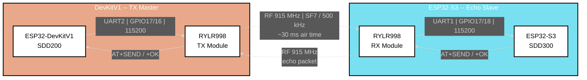
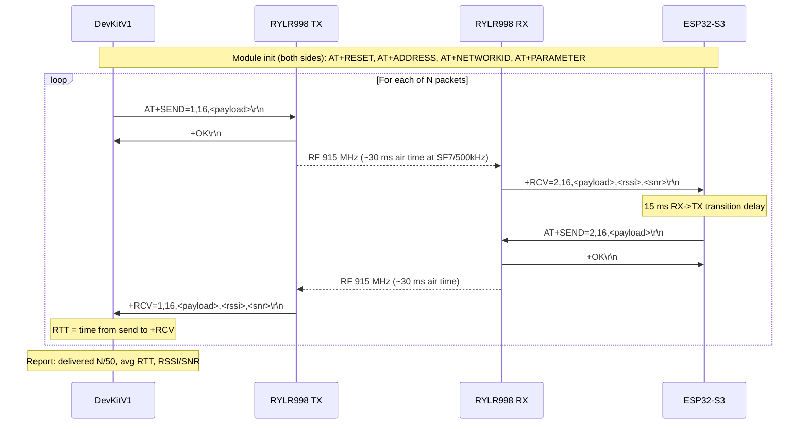
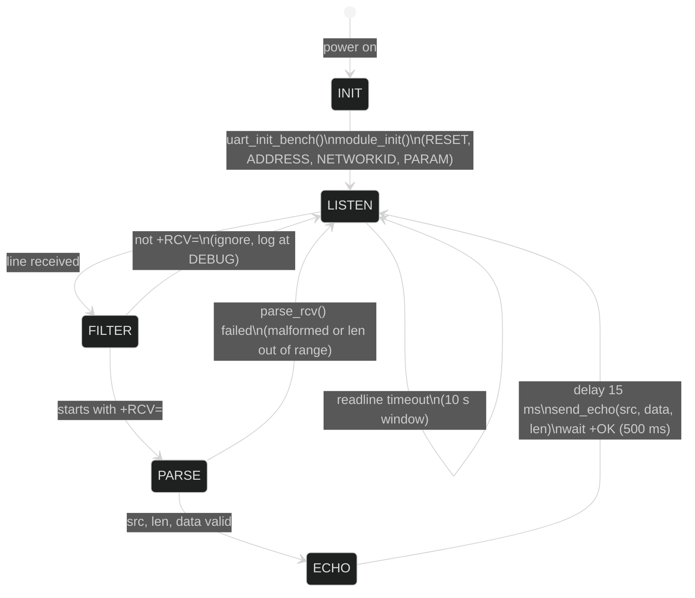
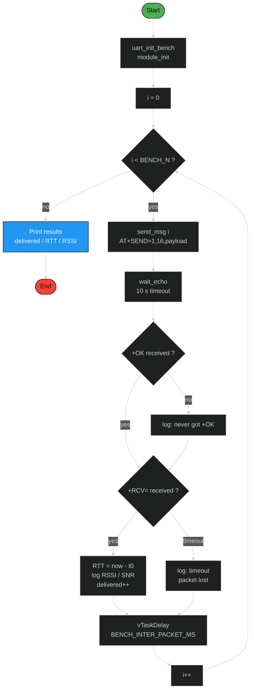
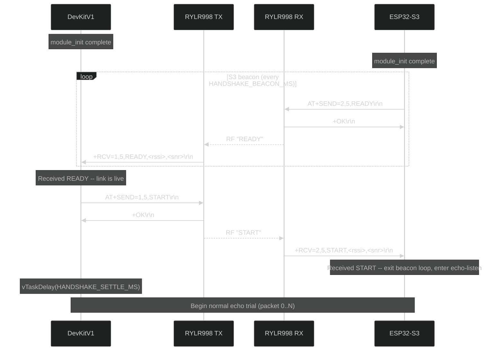
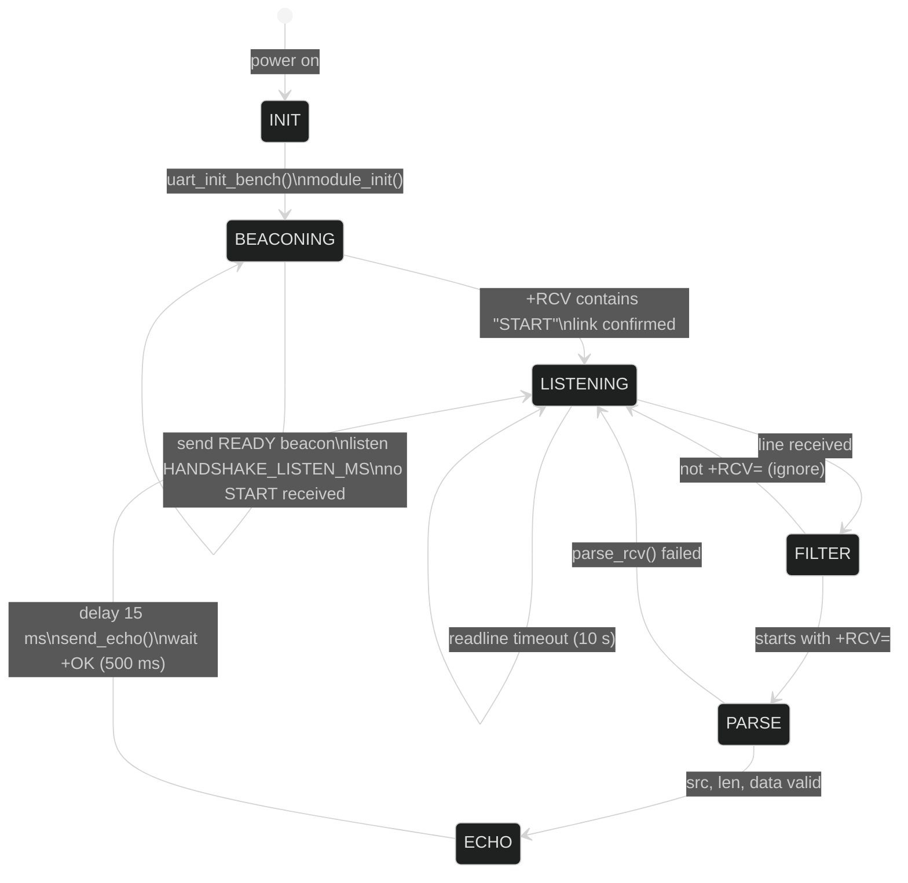
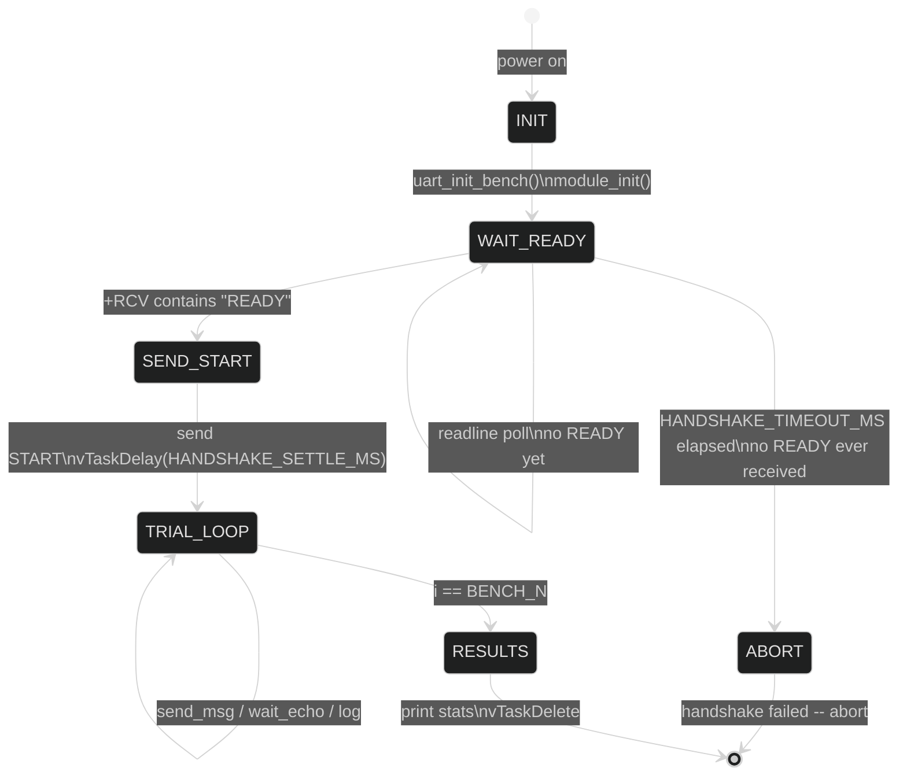
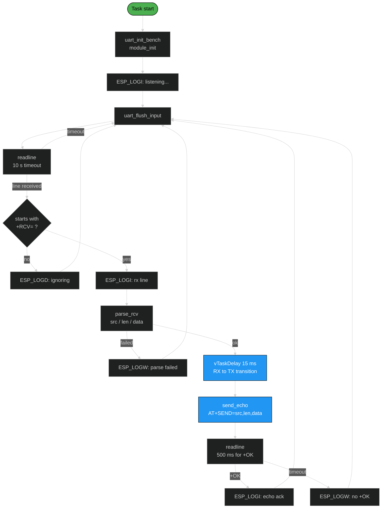

# Software Design Description 011
## LoRa Bench Test Protocol & Debug

---
 
## Overview
 
This document describes the design of the LoRa bench test framework used to validate the RF link between the **ESP32-DevKitV1 (TX master)** and the **ESP32-S3 (echo slave)** prior to integrating the full coefficient packet pipeline.
 
It also documents four bugs responsible for a **100% packet loss regression**, their root causes, and the corrected design.
 
> **Hardware:** REYAX RYLR998 x 2 | 915 MHz ISM band | AT-command over UART | Half-duplex LoRa
 
 
## Table of Contents
- [System Architecture](#system-architecture)
- [Hardware Setup](#hardware-setup)
- [AT Command Protocol](#at-command-protocol)
- [Bench Test Design](#bench-test-design)
- [State Machines](#state-machines)
- [Root Cause Analysis](#root-cause-analysis)
- [Corrected Data Flow](#corrected-data-flow)
- [Configuration Reference](#configuration-reference)
- [References](#references)
 
---
 
## System Architecture
 
The bench test isolates the wireless link between the two ESP32 boards. All other subsystems (camera, FPGA, sensors, WiFi) are disabled by the `TEST_MODE_LORA_BENCH` build flag.
 

 
 
## Hardware Setup
 
### DevKitV1 UART -> RYLR998 TX
 
| Signal      | ESP32 Pin | RYLR998 Pin | Direction          |
|-------------|-----------|-------------|--------------------|
| UART TX     | GPIO17    | RX          | ESP32 -> Module     |
| UART RX     | GPIO16    | TX          | Module -> ESP32     |
| UART Port   | UART_NUM_2 | --          | --                  |
| Baud Rate   | 115200    | --           | 8N1, no flow ctrl  |
 
### ESP32-S3 UART -> RYLR998 RX
 
| Signal      | ESP32 Pin | RYLR998 Pin | Direction          |
|-------------|-----------|-------------|--------------------|
| UART TX     | GPIO17    | RX          | ESP32 -> Module     |
| UART RX     | GPIO18    | TX          | Module -> ESP32     |
| UART Port   | UART_NUM_1 | --          | --                  |
| Baud Rate   | 115200    | --           | 8N1, no flow ctrl  |
 
> **Note:** The S3 RX pin (GPIO18) differs from the DevKitV1 RX pin (GPIO16). Swapping TX/RX on the S3 silently kills all comms with no error output.
 
 
## AT Command Protocol
 
The RYLR998 is not a transparent UART radio -- it has its own AT command layer that must be understood to use the module correctly.
 
```
---------------- TRANSMIT SIDE ----------------
 
ESP32  -->  AT+SEND=<dest>,<len>,<data>\r\n  -->  RYLR998
ESP32  <--  +OK\r\n                          <--  RYLR998
                (payload buffered; RF TX begins after +OK)
 
---------------- RECEIVE SIDE -----------------
 
RYLR998 -->  +RCV=<src>,<len>,<data>,<rssi>,<snr>\r\n  --> ESP32
```
 
### Field definitions
 
| Field    | Description                                              |
|----------|----------------------------------------------------------|
| `<dest>` | Destination module address (must match receiver's ADDRESS) |
| `<src>`  | Source module address                                    |
| `<len>`  | Payload byte count (1-240)                               |
| `<data>` | Raw payload bytes                                        |
| `<rssi>` | Received signal strength (dBm, negative)                 |
| `<snr>`  | Signal-to-noise ratio (dB)                               |
 
### Initialization sequence (both modules)
 
```
AT+RESET           ->  +RESET   (wait 1500 ms after reset)
AT+ADDRESS=<n>     ->  +OK
AT+NETWORKID=<n>   ->  +OK      <- both modules MUST share same ID
AT+PARAMETER=<SF>,<BW>,<CR>,<Preamble>  ->  +OK   <- must match on both
AT+ADDRESS?        ->  +ADDRESS=<n>      (verify)
AT+NETWORKID?      ->  +NETWORKID=<n>    (verify)
AT+PARAMETER?      ->  +PARAMETER=...    (verify)
AT+BAND?           ->  +BAND=...         (verify)
```
 
 
## Bench Test Design
 
The bench is a **request-response echo test**. The DevKitV1 is the master; the S3 is the slave. One packet is in-flight at a time.
 
### Complete packet exchange sequence
 

 
### Payload format
 
Each packet is `BENCH_PKT_SIZE` bytes (default 16):
 
```
Bytes [0..7]  : sequence number as 8-character lowercase hex ASCII  e.g. "00000003"
Bytes [8..15] : padding byte 'A' (0x41) repeated
```
 
> No null byte is placed in the wire payload. `snprintf` is used into a temporary buffer and then `memcpy`'d without the null terminator.
 
 
## State Machines
 
### S3 Echo Slave
 

 
### DevKitV1 TX Master
 

 
---
 
## Root Cause Analysis
 
Four bugs were found in the bench code. **Bugs 1 and 4 caused 100% packet loss.** Bugs 2 and 3 produced incorrect metrics.
 
 
### Bug 1 -- S3: UART driver delete/reinstall on every echo iteration *(root cause)*
 
**File:** `esp/esp32s3_wroom/main/src/lora_bench.c` lines 219-224
 
**Broken code:**
 
```c
uart_driver_delete(LORA_UART_NUM);   // <- unregisters GPIO from UART peripheral
vTaskDelay(pdMS_TO_TICKS(10));
uart_init_bench();                   // <- reinstalls driver + 300 ms settle delay
vTaskDelay(pdMS_TO_TICKS(10));
send_echo(src, data, len);
```
 
**Failure path:**
 

 
**Fix:** Remove the reinit entirely. The UART driver should be installed once and left running. The RYLR998 only needs 15 ms to transition from receive to transmit mode.
 
```c
// REMOVED: uart_driver_delete / uart_init_bench block
 
vTaskDelay(pdMS_TO_TICKS(15));   // RYLR998 RX->TX mode switch (per README)
send_echo(src, data, len);
```
 
 
### Bug 2 -- DevKitV1: Null byte embedded in wire payload
 
**File:** `esp/esp32_devkitv1/main/src/interprocessor/lora_bench.c`
 
```c
// BROKEN -- snprintf writes '\0' at payload[8]:
memset(payload, 'A', size);
snprintf((char *)payload, 9, "%08lx", (unsigned long)seq);
 
// FIXED -- separate buffer, memcpy without null:
memset(payload, 'A', size);
char seq_str[9];
snprintf(seq_str, sizeof(seq_str), "%08lx", (unsigned long)seq);
memcpy(payload, seq_str, 8);
```
 
Some RYLR998 firmware versions treat the `AT+SEND` data field as a C string and truncate at the first `\0`. Sending a 16-byte payload with a null at byte 8 could cause the module to transmit only 8 bytes, causing the echo to arrive with `len=8`. The DevKitV1's RSSI parsing offset (hardcoded to skip `BENCH_PKT_SIZE` bytes) would then land in the wrong field.
 
 
### Bug 3 -- DevKitV1: RTT timestamps 2.4% high
 
**File:** `esp/esp32_devkitv1/main/src/interprocessor/lora_bench.c`
 
```c
// BROKEN -- >> 10 divides by 1024, not 1000:
int64_t t0  = esp_timer_get_time() >> 10;
while ((esp_timer_get_time() >> 10) - t0 < timeout_ms)
int64_t rtt = (esp_timer_get_time() >> 10) - t0;
 
// FIXED -- true milliseconds:
int64_t t0  = esp_timer_get_time() / 1000;
while ((esp_timer_get_time() / 1000) - t0 < timeout_ms)
int64_t rtt = (esp_timer_get_time() / 1000) - t0;
```
 
`esp_timer_get_time()` returns microseconds. `>> 10` (/1024) gives units of 1024 us each. All RTT values and the timeout comparison used 1024 us as "1 ms," producing results 2.4% higher than actual and an effective timeout of 10.24 s instead of 10.00 s.
 
 
### Bug 4 -- Startup race: DevKitV1 transmits before S3 is listening

**Observed behavior:**

DevKitV1 sends all 50 packets, receives `+OK` for each (local module accepted the AT command), but never receives a `+RCV` echo. 100% timeout. Meanwhile the S3 log shows it received only one packet -- and that packet was **seq 2**, not seq 0. Packets 0 and 1 were transmitted over RF while the S3 was still in its post-init delay and not yet calling `readline`.

**Why this happens:**

The RYLR998 `+OK` response is **not a link-layer acknowledgment**. It means only that the local module accepted the `AT+SEND` command and will begin RF transmission. LoRa is a broadcast PHY -- there is no pairing, no connection state, and no indication from the module that a remote receiver exists or is ready. The DevKitV1 has no way to know whether the S3 is listening.

Both boards boot independently. Their init sequences (`uart_init_bench` -> 500 ms settle -> `module_init` with AT+RESET -> 1500 ms -> AT config -> 500 ms settle -> `listening...`) take different wall-clock times depending on bootloader, flash size detection, and PSRAM init (S3 only). In the observed run:

```
DevKitV1 sends first packet:  ~3184 ms after boot
S3 reaches listening state:   ~3757 ms after boot
```

The S3 is ~573 ms late. At the bench test's pace (~10.2 s per packet due to timeout + inter-packet delay), this only costs the first 1-2 packets. But those lost packets start the DevKitV1's timeout cascade, and any secondary failure (USB disconnect, module lockup from an unread +RCV in the S3's UART buffer) turns the rest of the trial into 100% loss.

**Why a fixed delay is not the right fix:**

Adding e.g. `vTaskDelay(pdMS_TO_TICKS(5000))` on the DevKitV1 before the send loop would paper over the race for bench-distance testing, but:

1. It's fragile -- the S3 boot time depends on flash size, PSRAM configuration, and any future init work. A change to either board's startup could reintroduce the race.
2. It doesn't scale -- when this protocol moves off the bench and onto hardware with variable power-on sequencing (battery, solar, field deployment), there's no guarantee which board powers up first.
3. It masks real failures -- if the S3 fails to init its module entirely, the DevKitV1 will silently wait out the delay and then run a full 50-packet trial against a dead link.

**Fix: Application-level ready handshake**

Since the RYLR998 provides no link-layer readiness signal, the application must implement one. The protocol is:

1. **S3 (echo slave)** completes `module_init`, then enters a beacon loop: it sends a short `READY` packet to the DevKitV1's address every `HANDSHAKE_BEACON_MS` (e.g., 1000 ms) and listens for a `START` response between beacons.

2. **DevKitV1 (TX master)** completes `module_init`, then enters a handshake-wait loop: it calls `readline` with a short timeout, looking for a `+RCV` containing the `READY` payload. Upon receiving it, it sends a `START` packet back to the S3's address.

3. **S3** receives the `START` packet (via `+RCV` during its listen window between beacons), exits the beacon loop, and enters the normal echo-listen state.

4. **DevKitV1** waits a short settle time after sending `START` (so the S3 has time to transition to listen mode), then begins the 50-packet trial.

If either board is not yet ready, the handshake simply hasn't completed -- there is no timeout cascade, no wasted packets, and the trial only starts when both sides have confirmed link connectivity.



### Handshake payload format

| Packet  | Sender   | Payload      | Length |
|---------|----------|--------------|--------|
| READY   | S3       | `READY`      | 5      |
| START   | DevKitV1 | `START`      | 5      |

These are plain ASCII, no sequence number or framing needed. The `parse_rcv` function already extracts the data field -- the handshake just checks `memcmp(data, "READY", 5)` or `memcmp(data, "START", 5)`.

### Handshake configuration

| Macro                      | Value  | Board    | Notes                                       |
|----------------------------|--------|----------|---------------------------------------------|
| `HANDSHAKE_BEACON_MS`      | 1000   | S3       | Interval between READY beacons              |
| `HANDSHAKE_LISTEN_MS`      | 500    | S3       | Listen window after each beacon for START   |
| `HANDSHAKE_TIMEOUT_MS`     | 30000  | DevKitV1 | Max time to wait for READY before aborting  |
| `HANDSHAKE_SETTLE_MS`      | 100    | DevKitV1 | Delay after sending START before first send |

### S3 handshake state machine



### DevKitV1 handshake state machine




### Bug 5 -- S3: System freeze on first RF transmission (TX power / power rail)

**Observed behavior:**

The S3 completes `module_init` (all AT configuration commands succeed), prints `waiting for handshake...`, enters `wait_for_start`, and sends its first `AT+SEND=2,5,READY`. The system immediately freezes -- no further log output from any task (including the heap monitor running in `app_main`). No crash dump, no watchdog trace, no reboot. The serial monitor shows garbled characters at the point of freeze.

On rare occasions the LoRa module completes the RF transmission before the ESP32-S3 dies, and the DevKitV1 receives the READY packet -- but only during the S3's death/reset event, never during normal operation.

**Root cause:**

The RYLR998 defaults to `AT+CRFOP=22` (maximum TX output power, +22 dBm). At this power level the SX1262 PA draws approximately **120 mA** during RF transmission. This current is drawn from the ESP32-S3 dev board's onboard 3.3 V LDO, which is also powering the ESP32-S3 itself (~100-200 mA). The combined load exceeds the regulator's capacity, causing the 3.3 V rail to sag.

The voltage drop is not deep enough to trigger the ESP32-S3's brownout detector (which would produce `rst:0x12 BROWNOUT_RESET`), but it is enough to corrupt the CPU state or stall the USB Serial JTAG debug interface. The result is a system that appears completely frozen -- no tasks run, no interrupts fire, no output is produced.

All AT commands during `module_init` (`AT+RESET`, `AT+ADDRESS`, `AT+NETWORKID`, `AT+PARAMETER`, queries) succeed because they are **configuration-only** -- they do not activate the RF power amplifier. `AT+SEND` is the first and only command that triggers actual RF transmission and the associated current spike.

**Why this wasn't caught earlier:**

The DevKitV1 (ESP32) uses a different dev board with a more capable LDO and does not exhibit the same power rail sag at CRFOP=22. The problem is specific to the ESP32-S3 board's power delivery.

**Fix (software):**

Reduce TX output power before any `AT+SEND` by adding `AT+CRFOP=7` to `module_init` on both boards. At +7 dBm (~5 mW), TX current drops to approximately 30 mA -- well within the LDO's headroom. This is sufficient for bench testing at desk distances (RSSI ~-25 to -45 dBm, SNR ~13-14 dB observed).

```c
/* In module_init(), after AT+PARAMETER, before verification queries */
at_cmd("AT+CRFOP=7\r\n", "+OK", LORA_AT_TIMEOUT_MS);
```

**Fix (hardware, for higher TX power / field range):**

The software fix limits range. To operate at higher CRFOP (needed for field distances of 1+ miles), the LoRa module's power supply must be decoupled from the ESP32's rail:

1. **Bulk capacitor (simplest PCB rework):** Solder a 100-470 uF electrolytic capacitor directly across the RYLR998's VCC and GND pins. The capacitor acts as a local energy reservoir -- it stores charge between transmissions and releases it instantly during the TX current spike, preventing the voltage rail from sagging while the regulator catches up.

2. **Separate regulator (next board revision):** Feed the RYLR998 from a dedicated 3.3 V LDO (e.g., AMS1117-3.3) powered from the 5 V USB rail. This fully isolates the module's TX transients from the ESP32's power domain.

**CRFOP vs range reference:**

| CRFOP | TX Power | Approx. TX Current | Range (LOS) | Notes |
|-------|----------|--------------------|-------------|-------|
| 7     | +7 dBm   | ~30 mA             | ~200 m      | Safe on dev board LDO |
| 14    | +14 dBm  | ~60 mA             | ~1 km       | May need cap |
| 22    | +22 dBm  | ~120 mA            | ~5+ km      | Requires cap or separate regulator |


## Corrected Data Flow
 
### S3 echo slave -- full corrected loop
 

 
 
## Configuration Reference
 
Both `config.h` files must define matching RF parameters. Bench mode is gated by `#define TEST_MODE_LORA_BENCH` on both boards.
 
  Macro                     DevKitV1     (WROOM) S3     Notes                                
 ------------------------- ------------ -------------- ------------------------------------- 
  `BENCH_SF`                7            7              Spreading factor -- **must match**   
  `BENCH_BW`                9            9              500 kHz -- **must match**            
  `BENCH_CR`                1            1              Coding rate 4/5 -- **must match**    
  `BENCH_PREAMBLE`          12           12             Preamble symbols -- **must match**   
  `LORA_NETWORK_ID`         6            6              Network ID -- **must match**         
  `LORA_ADDRESS_SENDER`     2            --             DevKitV1 module address              
  `LORA_ADDRESS_RECEIVER`   --           1              S3 module address                    
  `BENCH_DEST_ADDR`         1            --             DevKitV1 sends to S3 addr 1          
  `LORA_UART_NUM`           UART_NUM_2   UART_NUM_2     Different peripheral per board       
  `LORA_PIN_TX`             GPIO17       GPIO17         ESP32 TX -> Module RX                 
  `LORA_PIN_RX`             GPIO16       GPIO18         Module TX -> ESP32 RX                 
  `CRFOP`                   7            7              TX power (dBm) -- see Bug 5          
  `BENCH_PKT_SIZE`          16           --             Bytes per packet                     
  `BENCH_N`                 50           --             Packets per trial                    
  `BENCH_TIMEOUT_MS`        10000        --             Per-packet echo timeout (ms)         
  `BENCH_INTER_PACKET_MS`   10           --             Inter-packet gap (ms)                
  `LORA_AT_TIMEOUT_MS`      500          500            AT command response timeout (ms)     
 ------------------------- ------------ -------------- ------------------------------------- 
 
### Expected bench results (bench distance)
 
| Metric    | Expected        |
|-----------|-----------------|
| Delivery  | 50 / 50 (100%)  |
| Avg RTT   | ~160 ms         |
| RSSI      | ~-44 dBm        |
| SNR       | ~13 dB          |
 
---
 
## References
 
- [SDD003 -- LoRa Link Budget & Spreading Factor Calculations](./SDD003.md)
- [REYAX RYLR998 AT Command Reference](https://reyax.com/products/rylr998/)
- [ESP-IDF UART Driver API](https://docs.espressif.com/projects/esp-idf/en/stable/esp32/api-reference/peripherals/uart.html)
 
### Source files modified by this SDD
 
  File                                                     Change                                              
 -------------------------------------------------------- ---------------------------------------------------- 
  `esp32s3_wroom/main/src/lora_bench.c`                    Remove UART reinit; add 15 ms delay; add READY beacon handshake; add AT+CRFOP=7
  `esp32s3_wroom/main/inc/config.h`                        Change LORA_UART_NUM to UART_NUM_2
  `esp32_devkitv1/main/src/interprocessor/lora_bench.c`    Fix null byte; fix time units; simplify size clamp; add READY/START handshake; add AT+CRFOP=7
  `esp32_devkitv1/main/inc/config.h`                       Add HANDSHAKE_TIMEOUT_MS, HANDSHAKE_SETTLE_MS       
  `esp32s3_wroom/main/inc/config.h`                        Add HANDSHAKE_BEACON_MS, HANDSHAKE_LISTEN_MS        
 -------------------------------------------------------- ---------------------------------------------------- 
