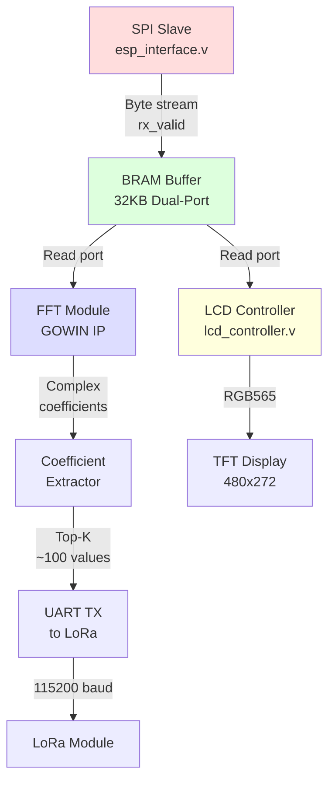

# Software Design Description 400
## Subsystem: FPGA Image Processing and Display Unit (Tang Nano 9K)

## References
- [SDD000](../../Documentation/SDDs/SDD000.md) - Development standards and architectural principles
- [FPGA Budget](./FPGA_Budget.md) - Resource utilization and timing analysis
- [Pin Map](./Pin_map.md) - Complete pin allocation reference

---

# Overview

## Hardware Platform
| Component | Specification                     |
|-----------|-----------------------------------|
| **FPGA**  | Gowin GW1NR-9C (Tang Nano 9K)     |
| **LUTs**  | 8640 total (4200 budgeted)        |
| **BRAM**  | 26 blocks @ 2KB each (52KB total) |
| **Clock** | 27 MHz system clock               |
| **Board** | Tang Nano 9K development board    |

## Development Toolchain
| Tool                   | Version              | Purpose                        |
|------------------------|----------------------|--------------------------------|
| **Yosys**              | Latest (open-source) | HDL synthesis                  |
| **nextpnr-himbaechel** | Latest               | Place and route (Gowin family) |
| **gowin_pack**         | Latest               | Bitstream generation           |
| **openFPGALoader**     | Latest               | FPGA programming               |

**Build System:** GNU Make (see `[Makefile](./Makefile)` in FPGA_Unit directory)

**Language:** Verilog (IEEE 1364-2005)

---

# Functional Scope

The FPGA subsystem performs three primary functions:

## 1. Image Data Reception
- **Interface:** SPI slave receiving from ESP32-DevKit
- **Protocol:** SPI Mode 0 (CPOL=0, CPHA=0)
- **Data rate:** ~2 Mbps (limited by SPI clock)
- **Buffering:** 32KB dual-port BRAM for frame storage

## 2. Image Compression & Transmission
- **Algorithm:** 2D FFT with Gaussian coefficient extraction
- **Implementation:** GOWIN IP core (256-point pipelined FFT)
- **Output:** Top-K FFT coefficients transmitted via LoRa UART
- **Compression ratio:** ~120:1 (480KB → 4KB)

## 3. Local Display Management
- **Display:** 480x272 RGB TFT LCD
- **Interface:** Parallel RGB565
- **Features:** Test pattern generation, button-cycled modes
- **Frame source:** BRAM buffer or test patterns

---

# Architecture

## Module Hierarchy

```
top.v
├── esp_interface.v       (SPI slave receiver)
├── bram_image_buffer.v   (32KB dual-port buffer)
├── lcd_controller.v      (RGB LCD timing generator)
└── [fft_module.v]        (GOWIN FFT IP - to be integrated)
```

## Data Flow Pipeline

```
ESP32-DevKit (SPI Master)
    ↓ SPI (MOSI, SCLK, CS)
esp_interface.v
    ↓ Parallel byte stream
BRAM write port (32KB buffer)
    ↓
    ├→ lcd_controller.v → RGB LCD (local display)
    └→ [fft_module.v] → Coefficient extraction → UART → LoRa
```

---

# Module Descriptions

## top.v - System Integration
**Purpose:** Top-level module connecting all subsystems

**Key Features:**
- Power-on reset generation (255-cycle delay)
- SPI-to-BRAM data path management
- Frame synchronization via CS edge detection
- Debug LED indicators for system state

**Interfaces:**
- **Input:** 27MHz system clock, SPI slave signals, button
- **Output:** RGB LCD signals, debug LEDs

**Critical Logic:**
- CS falling edge → reset write address, begin frame reception
- CS rising edge → mark frame complete, set `frame_ready` flag
- Continuous streaming: byte valid → write to BRAM, increment address

## esp_interface.v - SPI Slave Controller
**Purpose:** Receive image data from ESP32-DevKit via SPI

**Implementation Details:**
- **Clock domain crossing:** 3-stage synchronizer for metastability prevention
- **Edge detection:** Rising/falling edge detection for SPI clock
- **Shift register:** 8-bit serial-to-parallel conversion
- **Output:** Byte-wide parallel data with valid strobe

**SPI Protocol:**
- Mode 0: Sample on rising edge, shift on falling edge
- MSB-first bit ordering
- Active-low chip select

**Current Status:** ✅ Implemented and tested

## bram_image_buffer.v - Image Frame Buffer
**Purpose:** Dual-port RAM for concurrent write (SPI) and read (LCD/FFT)

**Implementation:**
- **Type:** Inferred single-clock dual-port RAM
- **Size:** 32KB (15-bit address space)
- **Synthesis:** Gowin BSRAM primitives (automatically inferred)

**Ports:**
- **Write:** SPI data stream (byte-wide)
- **Read:** LCD controller (byte-wide, grayscale)

**Note:** Current implementation uses 2KB for testing; will expand to 32KB for full image buffering.

**Current Status:** ✅ Functional, size to be expanded

## lcd_controller.v - RGB Display Driver
**Purpose:** Generate RGB LCD timing and display content

**LCD Specification:**
- **Resolution:** 480x272 pixels
- **Interface:** RGB565 (5-bit R, 6-bit G, 5-bit B)
- **Timing:** HSYNC, VSYNC, DE (data enable), pixel clock

**Features:**
- **Test patterns:** 8 modes (solid colors, bars, gradients, checkerboard, BRAM data)
- **Button control:** Debounced button cycles through patterns
- **BRAM display mode:** Pattern 7 displays frame buffer content

**Timing Parameters:**
```
Horizontal: 480 active + 2 front + 41 sync + 2 back = 525 total
Vertical:   272 active + 2 front + 10 sync + 2 back = 286 total
Pixel clock: 13.5 MHz (27 MHz / 2)
```

**Current Status:** ✅ Fully functional with test patterns

---

# FFT Compression Module (To Be Implemented)

## Implementation Strategy

### GOWIN FFT IP Core Integration
- **Core:** GOWIN 256-point pipelined FFT IP
- **Configuration:** Fixed-point, streaming mode
- **Input:** Image blocks (16x16 or 32x32 tiles)
- **Output:** Complex frequency coefficients

### Gaussian Coefficient Extraction
**Algorithm Overview:**
1. **2D FFT:** Apply row-then-column FFT to image blocks
2. **Magnitude computation:** Calculate |FFT[i]| for each coefficient
3. **Gaussian weighting:** Apply radial Gaussian mask (emphasize low frequencies)
4. **Top-K selection:** Select largest N weighted coefficients
5. **Quantization:** Reduce bit depth for transmission

**Compression Pipeline:**

```mermaid
flowchart TD
    IMG[Raw Image<br/>320x240 grayscale<br/>76.8 KB]
    TILE[Block Tiling<br/>16x16 blocks]
    FFT2D[2D FFT<br/>Row then Column]
    MAG[Magnitude<br/>Computation]
    GAUSS[Gaussian<br/>Weighting]
    TOPK[Top-K Selection<br/>N=50-100]
    QUANT[Quantization<br/>16-bit fixed]
    PACK[Packet<br/>Assembly]
    LORA[LoRa TX<br/>~4KB total]

     IMG --> TILE
     TILE --> FFT2D
     FFT2D --> MAG
     MAG --> GAUSS
     GAUSS --> TOPK
     TOPK --> QUANT
     QUANT --> PACK
     PACK --> LORA

     IMG -.->|76.8 KB| LORA
     LORA -.->|~4 KB<br/>120:1 compression| RX[Receiver]

     style IMG fill:#220000
     style FFT2D fill:#002200
     style GAUSS fill:#000022
     style LORA fill:#222200
```


### Reconstruction (Receiver Side)
**Performed on ESP32-S3 / Mobile App:**
1. Receive top-K coefficients
2. Reconstruct frequency domain with Gaussian interpolation
3. Inverse 2D FFT
4. Lightweight ML smoothing (optional, on mobile app)

**Rationale:** Moving reconstruction to receiver exploits available compute resources and simplifies FPGA logic.

---

# Resource Utilization

## Current Implementation (Without FFT)
| Module             | LUTs       | BRAM   | Status |
|--------------------|------------|--------|--------|
| LCD RGB Controller | ~800       | 0      | [X]    |
| SPI Slave          | ~200       | 0      | [X]    |
| Control logic      | ~300       | 0      | [X]    |
| BRAM buffer        | (inferred) | 16     | [X]    |
| **Total**          | **~1300**  | **16** | [X]    |

## Projected Utilization (With FFT)
| Module                 | LUTs      | BRAM      | Status       |
|------------------------|-----------|-----------|--------------|
| 256-pt Pipelined FFT   | ~2500     | 4-6       | TODO  [ ]    |
| Coefficient extraction | ~500      | 1         | TODO  [ ]    |
| Existing modules       | ~1300     | 16        | [X]          |
| **Total**              | **~4400** | **22-24** | [X] **FITS** |

**Margin:** ~4200 LUTs remaining, 2-4 BRAM blocks unused

---

# Timing Budget

## Image Processing Pipeline
```
ESP32-DevKit: Forward image
└─ SPI transfer: ~20ms (2 Mbps, 480KB image)

FPGA: Receive + Process
├─ SPI reception: ~20ms
├─ 2D FFT: ~2ms (pipelined, streaming)
├─ Coefficient extraction: ~1ms
└─ UART to LoRa: ~10ms (depends on baud rate)

Total FPGA latency: ~33ms
Effective throughput: ~7-10 FPS (limited by ML inference on DevKit)
```

---

# Interfaces

## SPI Slave (from ESP32-DevKit)
| Signal   | Direction | Pin | Description                  |
|----------|-----------|-----|------------------------------|
| esp_mosi | Input     | 49  | Master Out Slave In (data)   |
| esp_miso | Output    | 77  | Master In Slave Out (unused) |
| esp_sclk | Input     | 76  | SPI clock from master        |
| esp_cs_n | Input     | 48  | Chip select (active low)     |

**Protocol:** SPI Mode 0, byte-oriented streaming

## UART (to LoRa Module) - TODO
| Signal  | Direction | Pin | Description                 |
|---------|-----------|-----|-----------------------------|
| uart_tx | Output    | TBD | Transmit coefficients       |
| uart_rx | Input     | TBD | Receive commands (optional) |

**Baud rate:** 115200 or 460800 bps (to be determined based on LoRa module)

## RGB LCD Interface
| Signal     | Direction | Pins                   | Description            |
|------------|-----------|------------------------|------------------------|
| lcd_clk    | Output    | 35                     | Pixel clock (13.5 MHz) |
| lcd_de     | Output    | 33                     | Data enable            |
| lcd_hsync  | Output    | 40                     | Horizontal sync        |
| lcd_vsync  | Output    | 34                     | Vertical sync          |
| lcd_r[4:0] | Output    | 71, 73, 75, 74, 72     | Red channel            |
| lcd_g[5:0] | Output    | 69, 70, 57, 68, 56, 55 | Green channel          |
| lcd_b[4:0] | Output    | 54, 53, 51, 42, 41     | Blue channel           |

**Format:** RGB565 (16-bit color depth)

---

# Build System

## Makefile Targets
```bash
make            # Synthesize, place & route, pack bitstream
make program    # Build and flash to FPGA
make flash      # Flash existing bitstream (skip rebuild)
make clean      # Remove build artifacts
```

## Build Flow
1. **Synthesis:** Yosys converts Verilog → JSON netlist
2. **Place & Route:** nextpnr-himbaechel maps to FPGA fabric
3. **Pack:** gowin_pack generates .fs bitstream
4. **Program:** openFPGALoader flashes via USB-JTAG

**Build time:** ~30 seconds on typical development machine

---

# Development Status

## Completed ✅
- [x] SPI slave receiver with clock domain crossing
- [x] BRAM image buffer (dual-port)
- [x] RGB LCD controller with test patterns
- [x] Top-level integration and frame synchronization
- [x] Button debouncing and pattern cycling
- [x] Debug LED indicators
- [x] Build system and toolchain setup

## In Progress 🔄
- [ ] Expand BRAM to full 32KB
- [ ] Integrate GOWIN FFT IP core
- [ ] Implement coefficient extraction logic
- [ ] Add UART transmitter for LoRa interface

## Future Work 📋
- [ ] Power management (watchdog, sleep modes)
- [ ] Error detection/correction for LoRa transmission
- [ ] Dynamic compression ratio adjustment
- [ ] Touch interface support (if TFT supports touch)

---

# Testing Strategy

## Unit Testing
- **SPI Interface:** Verified with ESP32 sending test patterns
- **LCD Controller:** All 8 test patterns validated on physical display
- **BRAM:** Read/write verification via pattern mode 7

## Integration Testing
- **End-to-end:** ESP32 → SPI → FPGA → LCD (pending full image test)
- **FFT Module:** Simulation testbench required before synthesis

## Debug Capabilities
- **LEDs:** 6 debug LEDs indicate system state (receiving, frame ready, CS, etc.)
- **Test patterns:** Button-cycled patterns verify LCD timing
- **Serial monitor:** UART debug output (to be added)

---

# Known Issues & Limitations

1. **BRAM Size:** Current implementation uses 2KB; requires expansion to 32KB
2. **MISO Unused:** SPI slave currently sends dummy data on MISO (not needed for unidirectional transfer)
3. **FFT Not Integrated:** GOWIN IP core integration pending
4. **LoRa UART:** Physical interface not yet implemented

---

# References

## Vendor Documentation
- [Gowin GW1N FPGA Family Datasheet](https://www.gowinsemi.com)
- [Tang Nano 9K Schematic & Pinout](http://tangnano.sipeed.com)
- [GOWIN FFT IP Core User Guide](https://www.gowinsemi.com/en/support/ip_core/)

## Open-Source Toolchain
- [Yosys Open Synthesis Suite](https://github.com/YosysHQ/yosys)
- [nextpnr (Himbaechel for Gowin)](https://github.com/YosysHQ/nextpnr)
- [openFPGALoader](https://github.com/trabucayre/openFPGALoader)

## Standards
- IEEE 1364-2005 (Verilog HDL)
- SPI Protocol (Motorola/IEEE)
- RGB LCD Timing Specifications (VESA standards)
