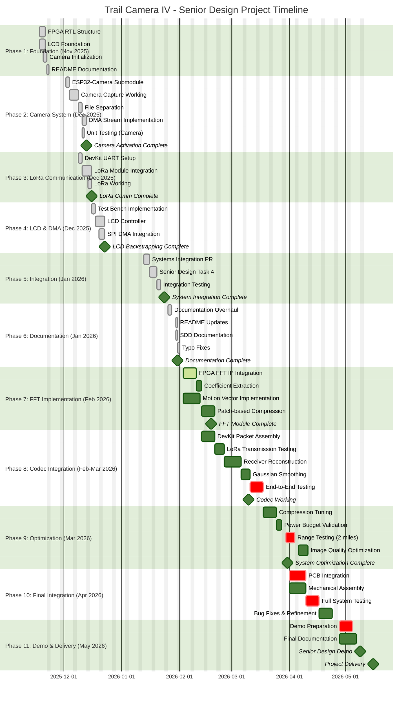

# SD403_TrailCamera_NDSU
**Work in Progress** | Senior Design Project | NDSU EE 2025-2026

## Brief

Remote trail camera system with 2-mile LoRa transmission using FPGA-accelerated FFT compression. Multi-processor architecture spanning ESP32-CAM, ESP32-DevKit, Tang Nano 9K FPGA, ESP32-S3 receiver, and mobile interface.

## Architectural Overview
TODO

## Components
- **ESP32-CAM** Image capture and SD storage
- **ESP32-DevKit** Sensor management and motor control
- **Tang Nano 9K FPGA** FFT compression and TFT display
- **ESP32-S3** FFT reconstruction and mobile API
- **Mobile App** Cross-platform UI (Flutter)

## Documentation
- [Software Design Documents](./Documentation/SDDs/SDD000.md)
- [Test Documents](./Documentation/TPD.md)
- [BOM Summary](./Documentation/BOM/BOM000.md)

## Project Info
- **Budget** <$300
- **Goal Range** 2 miles
- **Team** 3 members
  - Cole Zenk
  - Rhett Hudoba
  - Collin Lunde

## Todos and Timline

