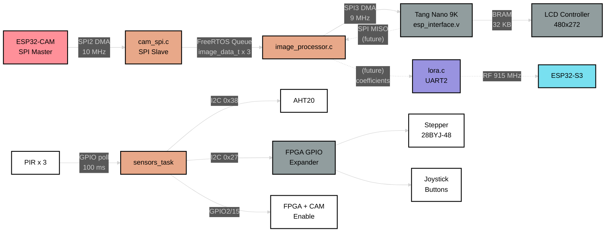

# Software Design Description 200
## ESP32-DevKitV1 Main Controller -- Overview

---

## Overview

The ESP32-DevKitV1 is the central hub of the trail camera system. It receives raw image frames from the ESP32-CAM over SPI slave DMA, forwards them to the Tang Nano 9K FPGA over a second SPI master bus for WHT compression, manages peripheral sensors (temperature/humidity via I2C), drives a stepper motor for pan positioning (via FPGA I2C GPIO expander), and monitors three PIR motion detectors to trigger the capture pipeline. Future: receive compressed coefficients from the FPGA via SPI MISO and transmit them over LoRa UART to the S3 receiver.

> **Hardware:** ESP32-DevKitV1 | No PSRAM | Dual SPI buses (SPI2 slave, SPI3 master) | UART2 to LoRa | I2C0 to FPGA + AHT20

---

## Detailed Documentation

| SDD | Title | Covers |
|-----|-------|--------|
| [SDD201](./SDD201.md) | Image Pipeline | cam_spi, image_processor, fpga_spi -- full data path from camera to FPGA |
| [SDD202](./SDD202.md) | I2C Bus & FPGA GPIO | i2c_bus driver, bus recovery, PCA9534 expander, steppers, buttons |
| [SDD203](./SDD203.md) | Sensors, PIR & Motor | PIR detect-respond loop, AHT20 driver, stepper ramp profiles |
| [SDD204](./SDD204.md) | ISR, Utilities & Config | Semaphore dispatch, DMA alloc, wire protocol, build flags, init sequence |
| [SDD205](./SDD205.md) | Settings Display | Button-driven menu on TFT LCD via SPI pixel stream to FPGA BRAM -- PLANNED |
| [SDD010](../../../Documentation/SDDs/SDD010.md) | LoRa Calculations | Link budget, spreading factor, bit rates |
| [SDD011](../../../Documentation/SDDs/SDD011.md) | LoRa Bench Test | Bench protocol, 5 bugs found, READY/START handshake |

---

## Module Hierarchy

```
main.c                              Entry point, init, task creation, heap monitor
|---- src/interprocessor/
|     |---- cam_spi.c               SPI slave -- receives frames from ESP32-CAM       [SDD201]
|     |---- fpga_spi.c              SPI master -- sends frames to FPGA                [SDD201]
|     |---- lora_uart.c             UART interface to RYLR998 LoRa module             [SDD010]
|     |---- lora_bench.c            LoRa bench test (TEST_MODE_LORA_BENCH)            [SDD011]
|     \---- i2c_bus.c               I2C master bus driver with recovery               [SDD202]
|---- src/peripherals/
|     |---- aht20.c                 Temperature/humidity sensor (I2C 0x38)            [SDD203]
|     |---- fpga_gpio.c             FPGA I2C GPIO expander (I2C 0x27)                [SDD202]
|     |---- motor.c                 Stepper motor: step table, ramp, swing            [SDD203]
|     |---- pir.c                   PIR motion detector GPIO input                    [SDD203]
|     \---- sensors_temp_humidity.c Sensor task: PIR poll, AHT20, motor, enable       [SDD203]
\---- src/utilities/
      |---- image_processor.c       Camera-to-FPGA passthrough (future: ML, diff)     [SDD201]
      |---- isr.c                   ISR semaphore init + handlers                     [SDD204]
      \---- utils.c                 Checksum, DMA alloc, validation                   [SDD204]
```

---

## Operating Modes

### Production Mode (default)

Five FreeRTOS tasks run concurrently:

| Task | Function | Priority | Stack | Purpose |
|------|----------|----------|-------|---------|
| cam_rx | `cam_spi_receive_task` | High (5) | 4 KB | Receive frames from ESP32-CAM over SPI |
| img_proc | `image_processor_task` | Medium (4) | 8 KB | Dequeue frames, forward to FPGA |
| lora_rx | `lora_receive_task` | Medium (4) | 4 KB | Listen for LoRa commands from S3 |
| sensors | `sensors_task` | Low (3) | 4 KB | PIR polling, AHT20, motor control |
| (main) | `monitor_heap` | -- | -- | Heap usage logging every 10s |

### LoRa Bench Mode (`TEST_MODE_LORA_BENCH`)

Only the `lora_bench_task` runs. All camera, FPGA, and sensor initialization is skipped. See [SDD011](../../../Documentation/SDDs/SDD011.md).

### Other Test Modes

- `TEST_MODE_FPGA_PATTERNS` -- cycle SPI test patterns to FPGA on button press
- `TEST_MODE_FPGA_GPIO` -- exercise I2C GPIO expander (buttons + steppers)
- `TEST_MODE_LORA_LOOPBACK` -- local LoRa echo
- `TEST_MODE_CAMERA_INJECT` -- inject synthetic frames at interval
- Mutually exclusive (enforced by `#error` in `config.h`)

---

## Bus Summary

| Bus | Host | Role | Peripheral | Clock | Detail |
|-----|------|------|------------|-------|--------|
| SPI2 | CAM_SPI_HOST | Slave | ESP32-CAM | 10 MHz (master sets) | DMA, 4 KB chunks |
| SPI3 | FPGA_SPI_HOST | Master | Tang Nano 9K | 9 MHz | DMA, 32 KB max, async queue/get |
| UART2 | LORA_UART_NUM | -- | RYLR998 LoRa | 115200 baud | AT command protocol, 8N1 |
| I2C0 | FPGA_I2C_PORT | Master | AHT20 + FPGA GPIO | 100 kHz | Mutex-protected, auto-recovery |

---

## Pin Map

| GPIO | Function | Direction | Bus/Module |
|------|----------|-----------|------------|
| 23 | SPI MOSI (cam) | In | SPI2 slave |
| 19 | SPI MISO (cam) | Out | SPI2 slave |
| 18 | SPI SCLK (cam) | In | SPI2 slave |
| 5 | SPI CS (cam) | In | SPI2 slave |
| 32 | SPI MOSI (fpga) | Out | SPI3 master |
| 33 | SPI MISO (fpga) | In | SPI3 master |
| 25 | SPI SCLK (fpga) | Out | SPI3 master |
| 26 | SPI CS (fpga) | Out | SPI3 master |
| 17 | UART TX (lora) | Out | UART2 |
| 16 | UART RX (lora) | In | UART2 |
| 21 | I2C SDA | Bidir | I2C0 |
| 22 | I2C SCL | Out | I2C0 |
| 35 | PIR1 | In | sensors |
| 34 | PIR2 | In | sensors |
| 4 | PIR3 | In | sensors |
| 13 | Stepper IN1 | Out | motor |
| 12 | Stepper IN2 | Out | motor |
| 14 | Stepper IN3 | Out | motor |
| 27 | Stepper IN4 | Out | motor |
| 2 | FPGA enable | Out | sensors |
| 15 | Camera enable | Out | sensors |
| 0 | Test button | In | ISR (GPIO interrupt) |

---

## Data Flow Summary



---

## References

- [SDD000 -- System Overview](../../../Documentation/SDDs/SDD000.md)
- [SDD100 -- ESP32-CAM](../../esp32cam/docs/SDD/SDD100.md)
- [SDD300 -- ESP32-S3 Receiver](../../esp32s3_wroom/docs/SDD/SDD300.md)
- [SDD400 -- FPGA Subsystem](../../../fpga/docs/SDD/SDD400.md)
