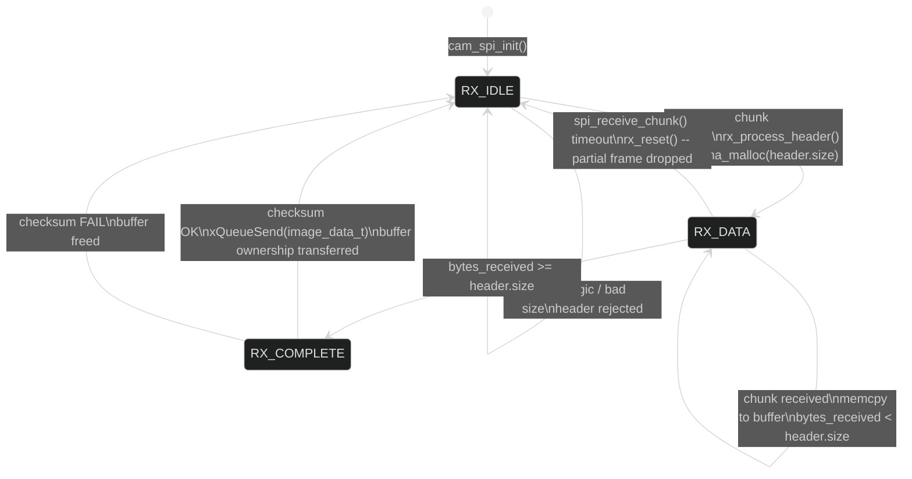
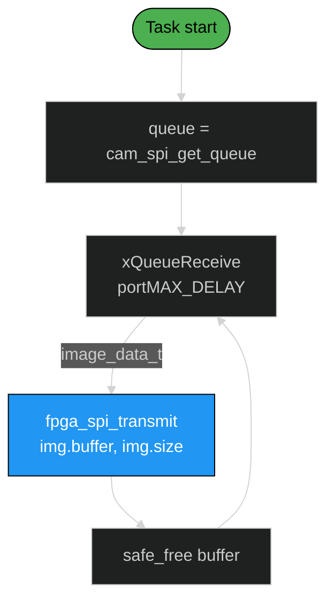
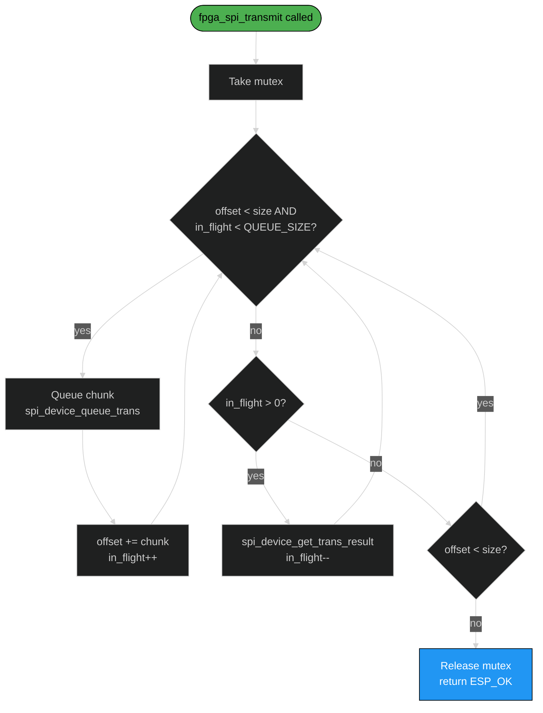

# Software Design Description 201
## Image Pipeline -- Camera to FPGA

---

## Overview

The image pipeline is the primary data path on the DevKitV1. It receives raw grayscale frames from the ESP32-CAM over SPI slave DMA, validates them, queues them, and forwards them to the Tang Nano 9K FPGA over a second SPI master DMA bus. Three modules and two FreeRTOS tasks form a producer-consumer chain with zero-copy handoff through a FreeRTOS queue.

> **Data path:** ESP32-CAM (SPI master) --> DevKitV1 (SPI slave) --> queue --> DevKitV1 (SPI master) --> FPGA (SPI slave)

---

## Table of Contents
- [Architecture](#architecture)
- [Wire Protocol](#wire-protocol)
- [cam_spi.c (SPI Slave Receiver)](#cam_spic-spi-slave-receiver)
- [image_processor.c (Pipeline Bridge)](#image_processorc-pipeline-bridge)
- [fpga_spi.c (SPI Master Transmitter)](#fpga_spic-spi-master-transmitter)
- [Pin Assignments](#pin-assignments)
- [Configuration Reference](#configuration-reference)
- [Source Files](#source-files)
- [References](#references)

---

## Architecture

```mermaid
---
config:
  theme: dark
---
flowchart LR
    subgraph CAM["ESP32-CAM (SPI Master)"]
        DMA_TX["dma_spi.c\nspi_dma_send_img()"]
    end

    subgraph DK["ESP32-DevKitV1"]
        subgraph RX["cam_rx task (High)"]
            SPI_SLV["SPI2_HOST\nSlave DMA"]
            SM["RX State Machine\nIDLE->DATA->COMPLETE"]
        end

        Q["FreeRTOS Queue\nimage_data_t x 3"]

        subgraph TX["img_proc task (Medium)"]
            FWD["image_processor.c\nDequeue + Forward"]
        end

        subgraph SPI_M["SPI Master"]
            FPGA_TX["SPI3_HOST\nMaster DMA\nAsync Queue/Get"]
        end
    end

    subgraph FPGA["Tang Nano 9K"]
        ESP_IF["esp_interface.v\nSPI Slave"]
    end

    DMA_TX -- "MOSI 10 MHz\n4 KB chunks" --> SPI_SLV
    SPI_SLV --> SM
    SM -- "xQueueSend" --> Q
    Q -- "xQueueReceive\nportMAX_DELAY" --> FWD
    FWD -- "fpga_spi_transmit()" --> FPGA_TX
    FPGA_TX -- "MOSI 9 MHz\n32 KB max" --> ESP_IF

    style DMA_TX fill:#fff,stroke:#000,stroke-width:2px,color:#000
    style SPI_SLV fill:#fff,stroke:#000,stroke-width:2px,color:#000
    style SM fill:#fff,stroke:#000,stroke-width:2px,color:#000
    style Q fill:#fff,stroke:#000,stroke-width:2px,color:#000
    style FWD fill:#fff,stroke:#000,stroke-width:2px,color:#000
    style FPGA_TX fill:#fff,stroke:#000,stroke-width:2px,color:#000
    style ESP_IF fill:#fff,stroke:#000,stroke-width:2px,color:#000
    style CAM fill:#ff9099,stroke:#000,stroke-width:2px
    style RX fill:#e8a889,stroke:#000,stroke-width:2px
    style TX fill:#e8a889,stroke:#000,stroke-width:2px
    style SPI_M fill:#e8a889,stroke:#000,stroke-width:2px
    style DK fill:#e8a889,stroke:#000,stroke-width:1px
    style FPGA fill:#919d9e,stroke:#000,stroke-width:2px
```



---

## Wire Protocol

The ESP32-CAM sends frames as a header followed by chunked raw pixel data. The DevKitV1 SPI slave reassembles the stream.

### Frame format (CAM --> DevKitV1)

```
 Transaction 1: Header (28 bytes)
 +-----------+-----------+-----------+-----------+
 | magic     | size      | checksum  | timestamp |
 | 0xCAFEBEEF| uint32    | XOR       | uint32    |
 | 4 bytes   | 4 bytes   | 4 bytes   | 4 bytes   |
 +-----------+-----------+-----------+-----------+
 | width     | height    | format    | reserved  |
 | uint16    | uint16    | uint8     | 7 bytes   |
 +-----------+-----------+-----------+-----------+
 Total: 28 bytes (IMAGE_HEADER_SIZE)

 Transactions 2..N: Data chunks (up to SPI_BUFFER_SIZE each)
 +--------------------------------------------------+
 | raw pixel data (up to 4096 bytes per chunk)       |
 +--------------------------------------------------+
 Repeated until all `size` bytes are transferred.
```

The CAM-side `spi_dma_send_img()` computes an XOR checksum over the full image before sending the header. The header and each data chunk are separate SPI transactions (separate CS assertions).

### Header validation

The DevKitV1 validates headers with two checks:
1. `magic == 0xCAFEBEEF`
2. `0 < size <= IMAGE_MAX_SIZE_BYTES` (1 MB)

If either check fails, the header is silently dropped and the state machine stays in `RX_IDLE`.

### Checksum

XOR checksum over all `size` bytes of pixel data:

```c
uint32_t checksum = 0;
for (size_t i = 0; i < size; i++)
    checksum ^= data[i];
```

Verified on the DevKitV1 after all data chunks are received. On failure, the entire frame is dropped and the buffer freed.

---

## cam_spi.c (SPI Slave Receiver)

### Responsibilities
- Initialize SPI2_HOST as slave with DMA
- Receive header + data chunks from ESP32-CAM
- Validate header magic and size
- Reassemble chunked data into a contiguous buffer
- Verify XOR checksum
- Enqueue validated `image_data_t` for downstream processing

### State machine



### SPI slave transaction

Each call to `spi_receive_chunk()` posts one slave transaction and blocks until the master (ESP32-CAM) clocks data in or the timeout expires:

```c
spi_slave_transaction_t trans = {
    .length    = SPI_BUFFER_SIZE * 8,   // 4096 bytes max
    .rx_buffer = rx_buf,                // DMA-aligned static buffer
    .tx_buffer = tx_buf,                // MISO (unused, zeroed)
};
spi_slave_transmit(CAM_SPI_HOST, &trans, timeout_ticks);
```

The actual received byte count comes from `trans.trans_len / 8`. This may be less than `SPI_BUFFER_SIZE` if the master sent a short transaction (e.g., the 28-byte header).

### Memory management

- `dma_malloc()` allocates a DMA-capable buffer for each incoming frame when the header arrives
- On successful queue insertion, `ctx.buffer` is set to NULL -- the queue consumer (`image_processor_task`) owns the allocation
- On queue full or checksum failure, the buffer is freed immediately via `safe_free()`
- The queue holds `image_data_t` structs (buffer pointer + size + header copy), not the pixel data itself

### MISO return path (stub)

Line 149 contains a stub for the return path:

```c
cam_spi_send_cmd(uint32_t cmd, uint32_t epoch) {}
```

The ESP32-CAM already reads `tx_buf` during each transaction (full-duplex SPI) and checks for a `0xDEADBEEF` magic in the MISO data. This path is wired but not yet populated -- it will carry `CMD_START` / `CMD_STOP` commands from the DevKitV1 to the camera.

---

## image_processor.c (Pipeline Bridge)

The simplest module in the pipeline. A single FreeRTOS task that dequeues validated frames and forwards them to the FPGA:



This module is the future insertion point for:
- Frame differencing (current - reference)
- ML motion detection / hot patch extraction
- Selective region forwarding to FPGA

Currently it is a raw passthrough.

---

## fpga_spi.c (SPI Master Transmitter)

### Responsibilities
- Initialize SPI3_HOST as master with DMA
- Transmit image data to FPGA in chunks up to `FPGA_MAX_TRANSFER_SIZE` (32 KB)
- Async queue/get pattern to keep the DMA pipeline fed with no idle gaps
- Mutex-protected access (safe for multiple callers)
- Optional test pattern generation (`TEST_MODE_FPGA_PATTERNS`)

### Async queue/get DMA pattern

Unlike the CAM SPI slave (which uses synchronous `spi_slave_transmit`), the FPGA SPI master uses an asynchronous pipeline to maximize throughput. Up to `FPGA_SPI_QUEUE_SIZE` (3) transactions can be in-flight simultaneously:



The pattern works like this:
1. Fill all available queue slots with chunks (up to 3 in-flight)
2. When the queue is full, collect one completed result (freeing a slot)
3. Immediately queue the next chunk into the freed slot
4. Repeat until all data is sent
5. Drain remaining in-flight transactions

This eliminates idle time between DMA transfers -- while the SPI hardware is clocking out one chunk, the next chunk is already queued and ready.

### Error drain

If any `spi_device_queue_trans` or `spi_device_get_trans_result` fails, the function drains all in-flight transactions before returning. This leaves the SPI queue clean for the next call.

### Test patterns (`TEST_MODE_FPGA_PATTERNS`)

When enabled, a test task waits on `g_button_sem` (GPIO0 falling edge ISR) and cycles through four patterns on each press:

| Pattern | Description |
|---------|-------------|
| `PAT_WHITE` | All 0xFF |
| `PAT_BLACK` | All 0x00 |
| `PAT_GRADIENT` | Horizontal gradient, left=0x00 right=0xFF, 480px period |
| `PAT_CHECKER` | 32x32 pixel checkerboard blocks |

Each pattern fills a 32 KB DMA buffer (`TEST_IMAGE_SIZE`) and transmits it as a single CS transaction matching the FPGA BRAM size.

---

## Pin Assignments

### CAM SPI (SPI2_HOST -- Slave)

| Signal | ESP32 GPIO | ESP32-CAM GPIO | Direction |
|--------|-----------|----------------|-----------|
| MOSI | GPIO23 | GPIO13 | CAM --> DevKit |
| MISO | GPIO19 | GPIO12 | DevKit --> CAM |
| SCLK | GPIO18 | GPIO14 | CAM --> DevKit |
| CS | GPIO5 | GPIO15 | CAM --> DevKit |

SPI mode 0 (CPOL=0, CPHA=0). CS pin has internal pull-up enabled on the DevKitV1 side.

### FPGA SPI (SPI3_HOST -- Master)

| Signal | ESP32 GPIO | FPGA Pin | Direction |
|--------|-----------|----------|-----------|
| MOSI | GPIO32 | Pin 77 | DevKit --> FPGA |
| MISO | GPIO33 | Pin 76 | FPGA --> DevKit |
| SCLK | GPIO25 | Pin 48 | DevKit --> FPGA |
| CS | GPIO26 | Pin 49 | DevKit --> FPGA |

SPI mode 0, 9 MHz clock. MISO is currently zeroed by the FPGA (`esp_interface.v` line 124) -- placeholder for coefficient return path.

---

## Configuration Reference

| Macro | Value | Notes |
|-------|-------|-------|
| `CAM_SPI_HOST` | SPI2_HOST | Slave bus for camera |
| `FPGA_SPI_HOST` | SPI3_HOST | Master bus for FPGA |
| `CAM_SPI_DMA_CHAN` | SPI_DMA_CH_AUTO | IDF auto-selects DMA channel |
| `FPGA_SPI_DMA_CHAN` | SPI_DMA_CH_AUTO | IDF auto-selects DMA channel |
| `CAM_SPI_MODE` | 0 | CPOL=0 CPHA=0 |
| `FPGA_SPI_MODE` | 0 | CPOL=0 CPHA=0 |
| `FPGA_SPI_CLOCK_MHZ` | 9 | 9 MHz master clock |
| `CAM_SPI_QUEUE_SIZE` | 3 | Slave transaction queue depth |
| `FPGA_SPI_QUEUE_SIZE` | 3 | Master async pipeline depth |
| `SPI_BUFFER_SIZE` | 4096 | Per-chunk receive buffer (cam slave) |
| `FPGA_MAX_TRANSFER_SIZE` | 32768 | Max single master transaction (BRAM size) |
| `CAM_TRANSFER_TIMEOUT_MS` | 5000 | Slave receive timeout |
| `IMAGE_MAX_SIZE_BYTES` | 1048576 | Max accepted frame size (1 MB) |
| `IMAGE_QUEUE_LENGTH` | 3 | Queue depth between cam_rx and img_proc |
| `IMAGE_HEADER_MAGIC` | 0xCAFEBEEF | Frame header magic word |
| `IMAGE_HEADER_SIZE` | 28 | Header struct size (bytes) |

---

## Source Files

| File | Lines | Purpose |
|------|-------|---------|
| `src/interprocessor/cam_spi.c` | 230 | SPI slave receiver, RX state machine, checksum, queue |
| `src/utilities/image_processor.c` | 47 | Queue consumer, raw passthrough to FPGA |
| `src/interprocessor/fpga_spi.c` | 260 | SPI master transmitter, async DMA, test patterns |
| `inc/cam_spi.h` | 43 | Public interface: init, deinit, get_queue, receive_task |
| `inc/fpga_spi.h` | 47 | Public interface: init, deinit, transmit, test_task |
| `inc/image_processor.h` | 17 | Public interface: init, task |

---

## References

- [SDD200 -- DevKitV1 Overview](./SDD200.md)
- [SDD100 -- ESP32-CAM](../../esp32cam/docs/SDD/SDD100.md) -- transmit side of the SPI link
- [SDD400 -- FPGA Subsystem](../../../fpga/docs/SDD/SDD400.md) -- `esp_interface.v` receive side
- [ESP-IDF SPI Slave API](https://docs.espressif.com/projects/esp-idf/en/stable/esp32/api-reference/peripherals/spi_slave.html)
- [ESP-IDF SPI Master API](https://docs.espressif.com/projects/esp-idf/en/stable/esp32/api-reference/peripherals/spi_master.html)
