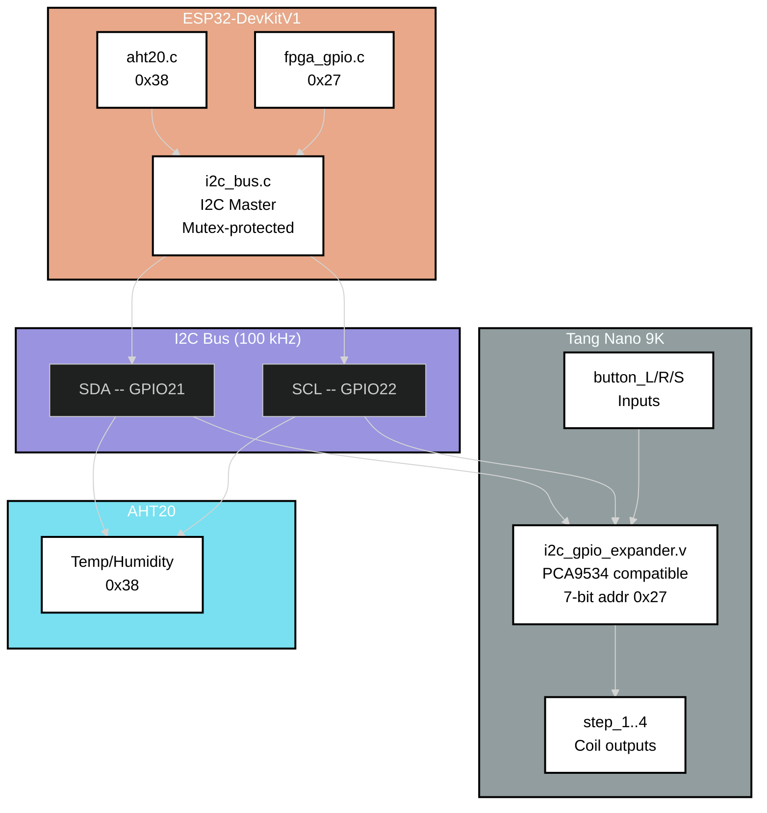
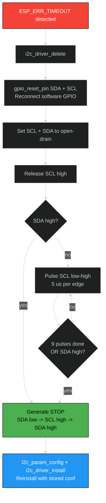

# Software Design Description 202
## I2C Bus & FPGA GPIO Expander

---

## Overview

The DevKitV1 uses a shared I2C bus to communicate with two peripherals: the AHT20 temperature/humidity sensor (address `0x38`) and a PCA9534-compatible GPIO expander implemented in Verilog on the Tang Nano 9K FPGA (address `0x27`). The bus driver (`i2c_bus.c`) provides mutex-protected access, automatic bus recovery on timeout, and a clean API used by all I2C clients. The FPGA GPIO expander client (`fpga_gpio.c`) drives stepper motor coils and reads joystick button state through this bus.

> **Hardware:** I2C0 at 100 kHz | SDA=GPIO21 SCL=GPIO22 | External 4.7k pull-ups | LVCMOS18 on FPGA side

---

## Table of Contents
- [Bus Architecture](#bus-architecture)
- [i2c_bus.c (Shared Bus Manager)](#i2c_busc-shared-bus-manager)
- [Bus Recovery](#bus-recovery)
- [fpga_gpio.c (GPIO Expander Client)](#fpga_gpioc-gpio-expander-client)
- [Register Map](#register-map)
- [FPGA Side (i2c_gpio_expander.v)](#fpga-side-i2c_gpio_expanderv)
- [Pin Assignments](#pin-assignments)
- [Test Mode (TEST_MODE_FPGA_GPIO)](#test-mode-test_mode_fpga_gpio)
- [Configuration Reference](#configuration-reference)
- [Source Files](#source-files)
- [References](#references)

---

## Bus Architecture



All I2C clients call through `i2c_bus.c`. The mutex ensures only one transaction is on the wire at a time. Both the AHT20 and FPGA GPIO expander share the same physical bus.

---

## i2c_bus.c (Shared Bus Manager)

### State

```c
static struct {
    i2c_port_t       port;
    i2c_config_t     conf;    // stored for bus recovery reinstall
    SemaphoreHandle_t mutex;
    bool             initialized;
} bus;
```

The `conf` field is retained so that `bus_recover()` can reinstall the driver with identical parameters after a timeout.

### API

| Function | Description |
|----------|-------------|
| `i2c_bus_init(cfg)` | Configure port, install driver, create mutex |
| `i2c_bus_deinit()` | Delete driver and mutex |
| `i2c_bus_lock(timeout)` | Take mutex (used internally, also public) |
| `i2c_bus_unlock()` | Give mutex |
| `i2c_bus_write(addr, data, len, timeout)` | START + addr(W) + data + STOP |
| `i2c_bus_read(addr, data, len, timeout)` | START + addr(R) + data + NACK last + STOP |
| `i2c_bus_write_read(addr, wr, wr_len, rd, rd_len, timeout)` | Repeated START: write phase then read phase |
| `i2c_bus_probe(addr, timeout)` | Send addr(W) + STOP, check for ACK |
| `i2c_bus_scan(timeout)` | Probe addresses 0x08--0x77, log all ACKing devices |

Every public read/write function follows the same pattern:
1. Check `bus.initialized`
2. Take mutex
3. Build I2C command link
4. Execute with `i2c_master_cmd_begin()`
5. On `ESP_ERR_TIMEOUT`: call `bus_recover()`
6. Release mutex

---

## Bus Recovery

When any I2C transaction times out, the bus may be stuck (SDA held low by a confused slave). The recovery sequence:



The 9-clock pulse sequence advances any slave's internal state machine past whatever state is holding SDA low. After pulsing, a STOP condition (SDA low -> SCL high -> SDA high) resets the bus. The driver is then reinstalled with the original configuration.

This recovery runs automatically -- callers see `ESP_ERR_TIMEOUT` returned but the bus is clean for the next attempt.

---

## fpga_gpio.c (GPIO Expander Client)

Thin wrapper over `i2c_bus_write` / `i2c_bus_write_read` that addresses the FPGA's PCA9534-compatible registers.

### API

| Function | Description |
|----------|-------------|
| `fpga_gpio_init()` | Write DIR, INVERT, and OUTPUT registers with boot defaults |
| `fpga_gpio_set_steppers(pattern)` | Write lower 4 bits to OUTPUT_PORT |
| `fpga_gpio_read_buttons(buttons)` | Read INPUT_PORT, mask to 3 button bits |

### Init sequence

```
write_reg(DIR_REG,    0xF0)   -- bits[7:4]=input, bits[3:0]=output
write_reg(INVERT_REG, 0x07)   -- bits[2:0] inverted (active-low buttons -> 1=pressed)
write_reg(OUTPUT_REG, 0x00)   -- all steppers off
```

---

## Register Map

The FPGA's `i2c_gpio_expander.v` implements four 8-bit registers at address `0x27`:

| Register | Addr | R/W | Reset | Description |
|----------|------|-----|-------|-------------|
| OUTPUT_PORT | 0x00 | R/W | 0x00 | Bits[3:0] drive step_1..step_4 coils |
| INPUT_PORT | 0x01 | R | -- | Bits[2:0] = button_L, button_R, button_S (after invert) |
| DIR_REG | 0x02 | R/W | 0xFF | 1=input, 0=output. Boot config: 0xF0 |
| INVERT_REG | 0x03 | R/W | 0x00 | Polarity invert. Boot config: 0x07 |

### Output gating

Stepper outputs are gated by the direction register in `top.v`:

```verilog
assign step_N = i2c_gpio_out[N] & ~i2c_gpio_dir[N];
```

A bit configured as input (`dir[N]=1`) forces the output low regardless of the output register value.

### Button input path

Physical buttons are active-low with external pull-ups. The FPGA synchronizes them through a 2-stage metastability filter before presenting them to the I2C input register:

```
Physical pin (active-low) --> btn_sync_0 --> btn_sync_1 --> i2c_gpio_in[2:0]
```

The INVERT_REG (`0x07`) flips bits[2:0] so the ESP32 reads `1` = pressed, `0` = released.

---

## FPGA Side (i2c_gpio_expander.v)

The Verilog module implements the I2C slave protocol and register file. Key details:

- 7-bit address match: `0x27`
- SDA is open-drain (active-low drive via `sda_oe` signal, external pull-up handles high)
- SCL is input-only (clock stretching not implemented)
- Register auto-increment on sequential reads

The I2C tristate is handled in `top.v`:

```verilog
assign i2c_sda = sda_oe ? 1'b0 : 1'bz;
```

---

## Pin Assignments

| Signal | ESP32 GPIO | FPGA Pin | FPGA Bank | Notes |
|--------|-----------|----------|-----------|-------|
| I2C SDA | GPIO21 | Pin 82 (IOT11A) | LVCMOS18 | 4.7k pull-up to 3.3V |
| I2C SCL | GPIO22 | Pin 81 (IOT11B) | LVCMOS18 | 4.7k pull-up to 3.3V |
| step_1 | -- | Pin 25 | -- | Coil A via ULN2003 |
| step_2 | -- | Pin 26 | -- | Coil B via ULN2003 |
| step_3 | -- | Pin 27 | -- | Coil C via ULN2003 |
| step_4 | -- | Pin 28 | -- | Coil D via ULN2003 |
| button_L | -- | Pin 84 | -- | Active-low, pull-up |
| button_R | -- | Pin 83 | -- | Active-low, pull-up |
| button_S | -- | Pin 85 | -- | Active-low, pull-up |

---

## Test Mode (TEST_MODE_FPGA_GPIO)

When `TEST_MODE_FPGA_GPIO` is defined, `fpga_gpio_test_task` runs alongside the normal tasks. It:

1. Sends an initial gradient pattern to the FPGA over SPI
2. Polls `fpga_gpio_read_buttons()` every 50 ms
3. On button press:
   - L: previous test pattern
   - R: next test pattern
   - S: reset to gradient
4. Sends the selected pattern to FPGA BRAM over SPI
5. Mirrors button presses to stepper outputs (L=step_1, R=step_2, S=all)

This exercises both the I2C read path (buttons) and write path (steppers) alongside the SPI data path.

---

## Configuration Reference

| Macro | Value | Notes |
|-------|-------|-------|
| `FPGA_I2C_PORT` | I2C_NUM_0 | I2C peripheral |
| `FPGA_I2C_SDA_PIN` | GPIO21 | SDA |
| `FPGA_I2C_SCL_PIN` | GPIO22 | SCL |
| `FPGA_I2C_CLK_HZ` | 100000 | 100 kHz (safe for LVCMOS18) |
| `FPGA_I2C_ADDR` | 0x27 | Expander slave address |
| `FPGA_I2C_TIMEOUT_MS` | 100 | Per-transaction timeout |
| `FPGA_GPIO_REG_OUT` | 0x00 | Output port register |
| `FPGA_GPIO_REG_IN` | 0x01 | Input port register |
| `FPGA_GPIO_REG_DIR` | 0x02 | Direction register |
| `FPGA_GPIO_REG_INV` | 0x03 | Polarity invert register |
| `FPGA_GPIO_DIR_BOOT` | 0xF0 | bits[7:4]=in, bits[3:0]=out |
| `FPGA_GPIO_INV_BOOT` | 0x07 | bits[2:0] inverted for buttons |

---

## Source Files

| File | Lines | Purpose |
|------|-------|---------|
| `src/interprocessor/i2c_bus.c` | 327 | Shared I2C bus: init, R/W, probe, scan, recovery |
| `src/peripherals/fpga_gpio.c` | 197 | GPIO expander client: steppers, buttons, test task |
| `inc/peripherals/i2c_bus.h` | 35 | Bus config struct, public API |
| `inc/peripherals/fpga_gpio.h` | 65 | Expander API, register docs, wiring notes |

---

## References

- [SDD200 -- DevKitV1 Overview](./SDD200.md)
- [SDD400 -- FPGA Subsystem](../../../fpga/docs/SDD/SDD400.md) -- `i2c_gpio_expander.v` implementation
- [PCA9534 Datasheet](https://www.ti.com/lit/ds/symlink/pca9534.pdf) -- register-compatible reference
- [ESP-IDF I2C Driver (Legacy)](https://docs.espressif.com/projects/esp-idf/en/v5.2/esp32/api-reference/peripherals/i2c.html)
