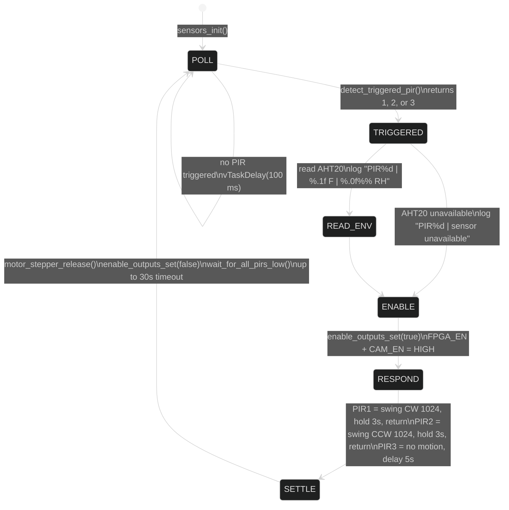
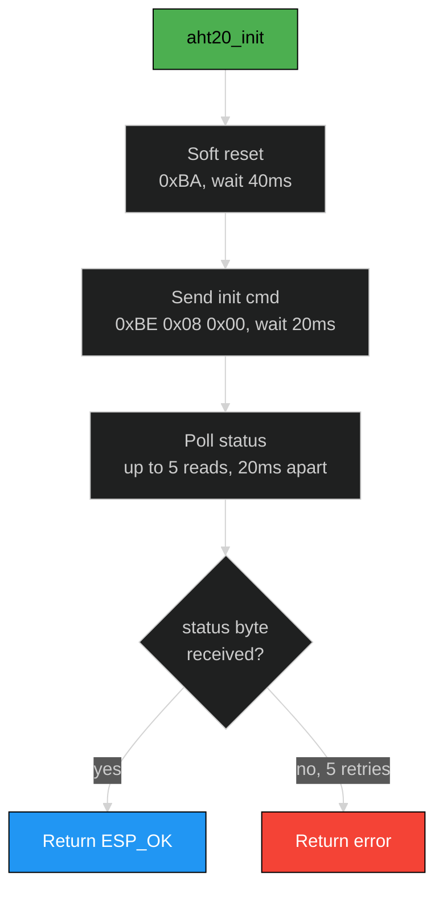
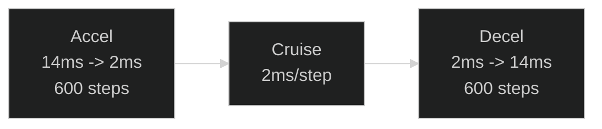

# Software Design Description 203
## Sensors, PIR & Motor Subsystem

---

## Overview

The sensor subsystem manages three PIR motion detectors, an AHT20 temperature/humidity sensor, a 28BYJ-48 stepper motor (via ULN2003 driver), and FPGA/camera enable pins. These are orchestrated by a single FreeRTOS task (`sensors_task`) that polls PIR inputs, reads environmental data, activates the camera and FPGA, and drives the stepper to aim at the triggered zone. Four source files implement the subsystem: `sensors_temp_humidity.c` (orchestrator), `aht20.c` (I2C sensor driver), `pir.c` (GPIO input), and `motor.c` (stepper sequences).

> **Hardware:** 3x PIR sensors | AHT20 on I2C0 (0x38) | 28BYJ-48 stepper + ULN2003 | FPGA/CAM enable GPIOs

---

## Table of Contents
- [Sensor Task State Machine](#sensor-task-state-machine)
- [PIR Motion Detectors](#pir-motion-detectors)
- [AHT20 Temperature/Humidity Sensor](#aht20-temperaturehumidity-sensor)
- [Stepper Motor](#stepper-motor)
- [FPGA & Camera Enable](#fpga--camera-enable)
- [Pin Assignments](#pin-assignments)
- [Source Files](#source-files)
- [References](#references)

---

## Sensor Task State Machine

The `sensors_task` runs at low priority and implements a detect-respond-settle loop:



### Response per PIR zone

| PIR | GPIO | Direction | Motor Action | Total Active Time |
|-----|------|-----------|--------------|-------------------|
| PIR1 | GPIO35 | Left | CW 1024 steps, hold 3s, reverse 1024 | ~8s (ramp + hold + ramp) |
| PIR2 | GPIO34 | Right | CCW 1024 steps, hold 3s, reverse 1024 | ~8s |
| PIR3 | GPIO4 | Center | No motor, hold 5s | 5s |

1024 full steps on the 28BYJ-48 is approximately 90 degrees of rotation.

### Settle phase

After responding, the task waits for all three PIR outputs to return LOW before re-entering the poll loop. This prevents retriggering on the same motion event. The wait has a 30-second timeout (`PIR_SETTLE_TIMEOUT_MS`) to avoid permanent stalls if a PIR stays asserted.

---

## PIR Motion Detectors

### pir.c

Minimal GPIO input driver. Configures three pins as inputs and provides `pir_read()`:

```c
esp_err_t pir_init(int pir1, int pir2, int pir3);
bool      pir_read(pir_id_t pir);   // returns gpio_get_level()
```

The `sensors_temp_humidity.c` orchestrator does not use `pir.c` directly -- it calls `gpio_get_level()` inline through `detect_triggered_pir()` for minimal overhead. `pir.c` exists as a standalone module for use by other subsystems.

### GPIO configuration

| PIR | GPIO | Input Mode | Pull-down |
|-----|------|-----------|-----------|
| PIR1 | GPIO35 | Input only | Disabled (input-only pin, no pull available) |
| PIR2 | GPIO34 | Input only | Disabled (input-only pin, no pull available) |
| PIR3 | GPIO4 | Input/Output capable | Enabled |

GPIO 34 and 35 are input-only pins on the ESP32 -- they have no internal pull-up or pull-down capability. GPIO4 is a general-purpose pin with pull-down enabled.

---

## AHT20 Temperature/Humidity Sensor

### aht20.c

I2C driver for the AHT20 at address `0x38`. Uses `i2c_bus.c` for all bus access.

### Init sequence



### Measurement protocol

```
Write:  [0xAC, 0x33, 0x00]     Trigger measurement
Wait:   90 ms                   Conversion time
Read:   6 bytes                 [status, hum[19:12], hum[11:4], hum[3:0]|temp[19:16], temp[15:8], temp[7:0]]
```

Status byte bit 7 = busy. The driver polls up to 10 times (10 ms apart) waiting for busy to clear.

### Raw-to-physical conversion

```
humidity (%) = hum_raw * 100.0 / 2^20
temperature (C) = temp_raw * 200.0 / 2^20 - 50.0
```

Where:
- `hum_raw` = 20-bit value from bytes [1:3] upper nibble
- `temp_raw` = 20-bit value from bytes [3] lower nibble + bytes [4:5]

The orchestrator converts Celsius to Fahrenheit for logging: `F = C * 9/5 + 32`.

---

## Stepper Motor

### motor.c

Driver for the 28BYJ-48 unipolar stepper motor through a ULN2003 Darlington array. Implements trapezoidal velocity ramping for smooth motion.

### Step sequence

2-coil full-step pattern (highest torque):

| Phase | IN1 | IN2 | IN3 | IN4 | Coils |
|-------|-----|-----|-----|-----|-------|
| 0 | 1 | 1 | 0 | 0 | AB |
| 1 | 0 | 1 | 1 | 0 | BC |
| 2 | 0 | 0 | 1 | 1 | CD |
| 3 | 1 | 0 | 0 | 1 | DA |

Direction is determined by incrementing or decrementing the phase index (mod 4).

### Wire map

The `wire_map[4]` field in `motor_stepper_t` remaps logical coil indices to physical GPIO outputs. The default map `{1, 0, 3, 2}` swaps coil pairs to fix a common wiring issue where the motor vibrates instead of rotating.

### Trapezoidal ramp profile



`motor_stepper_move_ramped(m, steps, dir, start_ms, min_ms, ramp)`:

```
step delay (ms)
  ^
14|*
  | *
  |  *
  |   *
  |    *---------------------------*
2 |    |       cruise              |   *
  |    |                           |    *
  |    |                           |     *
  +----+---------------------------+------+----> step
  0   600                      steps-600  steps
```

- Ramp phase: delay linearly interpolated from `start_ms` (14) down to `min_ms` (2) over `ramp` steps (600)
- Cruise phase: constant `min_ms` delay
- Deceleration: mirror of acceleration ramp
- If total steps < 2*ramp, ramp is shortened to `steps/2`

### High-level API

| Function | Description |
|----------|-------------|
| `motor_stepper_swing_cw(m, steps, hold_ms)` | CW ramp, hold, reverse ramp, release |
| `motor_stepper_swing_ccw(m, steps, hold_ms)` | CCW ramp, hold, reverse ramp, release |
| `motor_stepper_swing_and_release(m, steps, dir, hold_ms)` | Generic swing + return + release |
| `motor_stepper_release(m)` | De-energize all coils (prevents heating) |

---

## FPGA & Camera Enable

Two GPIO outputs gate power to the FPGA and camera subsystems:

| Signal | GPIO | Purpose |
|--------|------|---------|
| FPGA_EN | GPIO2 | Enable FPGA power/clock |
| CAM_EN | GPIO15 | Enable camera module |

Both are driven LOW on boot (`enable_outputs_init()`). When a PIR triggers, both are driven HIGH (`enable_outputs_set(true)`) for the duration of the motor response. After the motor sequence completes and coils are released, both are driven LOW again.

This allows the system to keep the FPGA and camera powered down during idle periods to conserve energy -- relevant for battery/solar field deployment.

---

## Pin Assignments

| Signal | GPIO | Direction | Notes |
|--------|------|-----------|-------|
| PIR1 | GPIO35 | Input | Input-only pin, no pull |
| PIR2 | GPIO34 | Input | Input-only pin, no pull |
| PIR3 | GPIO4 | Input | Pull-down enabled |
| Stepper IN1 | GPIO13 | Output | ULN2003 input A |
| Stepper IN2 | GPIO12 | Output | ULN2003 input B |
| Stepper IN3 | GPIO14 | Output | ULN2003 input C |
| Stepper IN4 | GPIO27 | Output | ULN2003 input D |
| FPGA_EN | GPIO2 | Output | FPGA power enable |
| CAM_EN | GPIO15 | Output | Camera power enable |
| I2C SDA | GPIO21 | Open-drain | Shared with FPGA GPIO expander |
| I2C SCL | GPIO22 | Open-drain | Shared with FPGA GPIO expander |

---

## Source Files

| File | Lines | Purpose |
|------|-------|---------|
| `src/peripherals/sensors_temp_humidity.c` | 225 | Orchestrator: PIR poll, AHT20 read, motor + enable |
| `src/peripherals/aht20.c` | 106 | AHT20 I2C driver: init, measure, convert |
| `src/peripherals/pir.c` | 33 | PIR GPIO input: init, read |
| `src/peripherals/motor.c` | 134 | Stepper driver: step table, ramp, swing, release |
| `inc/peripherals/sensors_temp_humidity.h` | 12 | Public: sensors_init, sensors_task |
| `inc/peripherals/aht20.h` | 22 | Public: aht20_t struct, init, read |
| `inc/peripherals/pir.h` | 16 | Public: pir_id_t enum, init, read |
| `inc/peripherals/motor.h` | 57 | Public: motor_stepper_t, all motion functions |

---

## References

- [SDD200 -- DevKitV1 Overview](./SDD200.md)
- [SDD202 -- I2C Bus & FPGA GPIO](./SDD202.md) -- I2C bus driver used by AHT20
- [AHT20 Datasheet](https://asairsensors.com/wp-content/uploads/2021/09/Data-Sheet-AHT20-Humidity-and-Temperature-Sensor-ASAIR-V1.0.03.pdf)
- [28BYJ-48 Stepper Reference](https://components101.com/motors/28byj-48-stepper-motor)
