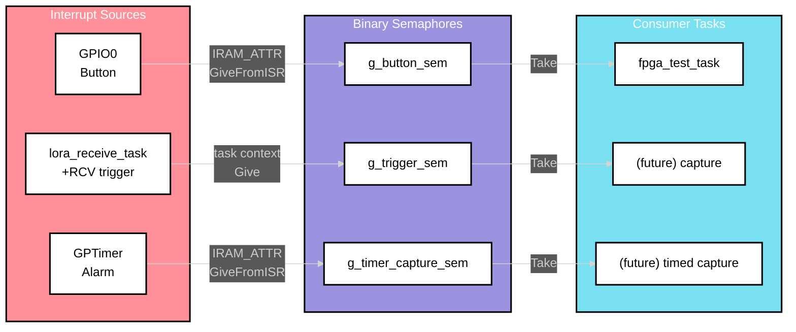
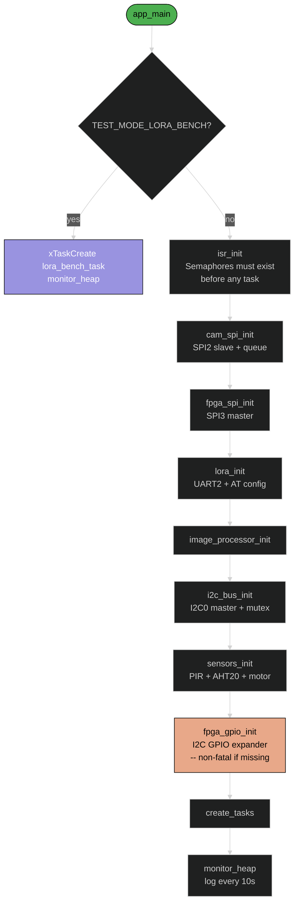

# Software Design Description 204
## ISR Signals, Utilities & Build Configuration

---

## Overview

This document covers the shared infrastructure that supports all other DevKitV1 modules: the ISR signal dispatch system (`isr.c`), common utility functions (`utils.c` / `utils.h`), the wire protocol definitions, and the build configuration system (`config.h`). These are not standalone subsystems but foundational code that every other module depends on.

---

## Table of Contents
- [ISR Signal Dispatch](#isr-signal-dispatch)
- [Utilities](#utilities)
- [Wire Protocol](#wire-protocol)
- [Build Configuration](#build-configuration)
- [Test Mode System](#test-mode-system)
- [Init Sequence](#init-sequence)
- [Source Files](#source-files)

---

## ISR Signal Dispatch

### Design

All ISR handlers live in `isr.c`. They do no work beyond giving a semaphore. Business logic runs in the task that takes the semaphore. This keeps ISR handlers minimal and deterministic.

### Semaphores

| Semaphore | Type | Producer | Consumer | Purpose |
|-----------|------|----------|----------|---------|
| `g_trigger_sem` | Binary | `ISR_OnLoRaTrigger()` | (future) capture task | LoRa command received -> start capture |
| `g_button_sem` | Binary | `ISR_OnButtonPress()` | `fpga_test_task` | GPIO0 falling edge -> cycle test pattern |
| `g_timer_capture_sem` | Binary | `ISR_OnTimerAlarm()` | (future) timed capture | GPTimer alarm -> periodic capture |

All three are created as binary semaphores in `isr_init()`, which must be called before any task creation.

### Handler details

| Handler | Context | Attribute | Trigger |
|---------|---------|-----------|---------|
| `ISR_OnLoRaTrigger()` | Task | -- | Called from `lora_receive_task` when `+RCV` contains trigger payload |
| `ISR_OnButtonPress()` | ISR | `IRAM_ATTR` | GPIO0 falling edge (negative edge interrupt) |
| `ISR_OnTimerAlarm()` | ISR | `IRAM_ATTR` | GPTimer alarm event callback |

`ISR_OnLoRaTrigger` is named with the ISR prefix for consistency but runs in task context (called directly from `lora_receive_task`). It uses `xSemaphoreGive()`, not `xSemaphoreGiveFromISR()`.

`ISR_OnButtonPress` and `ISR_OnTimerAlarm` are true ISR-context handlers. They use `xSemaphoreGiveFromISR()` with `portYIELD_FROM_ISR()` for immediate context switch to the waiting task.

### Signal flow



---

## Utilities

### utils.h -- Inline functions (hot path)

All performance-critical utilities are `ALWAYS_INLINE` (force-inlined with `__attribute__((always_inline)) static inline`):

| Function | Purpose |
|----------|---------|
| `checksum_calculate_xor(data, size)` | XOR checksum over byte array |
| `checksum_verify_xor_fast(data, size, expected)` | Calculate + compare in one call |
| `validate_image_header_fast(header)` | Check magic + size bounds |
| `validate_size_fast(size, max)` | `0 < size <= max` |
| `safe_free(ptr)` | `free(*ptr); *ptr = NULL;` (NULL-safe) |
| `min_size(a, b)` | `(a < b) ? a : b` |
| `max_size(a, b)` | `(a > b) ? a : b` |
| `align_4(size)` | Round up to 4-byte boundary `(size + 3) & ~3` |

### utils.c -- Logging versions

Non-inlined versions of the same functions that add `ESP_LOGW` on failure. Used in init paths and error reporting where the log output is more valuable than the cycle cost:

| Function | Difference from inline version |
|----------|-------------------------------|
| `checksum_verify_xor()` | Logs expected vs actual on mismatch |
| `validate_image_header()` | Logs which field failed (magic or size) |
| `validate_size()` | Logs size vs max on failure |

### dma_malloc

```c
void *dma_malloc(size_t size)
{
    size = align_4(size);
    return heap_caps_malloc(size, MALLOC_CAP_DMA);
}
```

Allocates from DMA-capable memory (internal SRAM, 4-byte aligned). Required for all SPI DMA buffers. Returns NULL on failure with an `ESP_LOGE`.

---

## Wire Protocol

Defined in `config.h` and used by `cam_spi.c` for frame reception:

### image_header_t

```c
typedef struct {
    uint32_t magic;       // 0xCAFEBEEF
    uint32_t size;        // payload byte count
    uint32_t checksum;    // XOR over payload
    uint32_t timestamp;   // sender timestamp
    uint16_t width;       // frame width in pixels
    uint16_t height;      // frame height in pixels
    uint8_t  format;      // pixel format identifier
    uint8_t  reserved[7]; // padding to 28 bytes
} __attribute__((packed)) image_header_t;
```

Compile-time assertion ensures the struct is exactly 28 bytes:

```c
_Static_assert(sizeof(image_header_t) == IMAGE_HEADER_SIZE,
               "Image header must be 24 bytes");
```

(Note: the assertion message says "24 bytes" but `IMAGE_HEADER_SIZE` is 28. The assertion itself is correct -- it checks against the macro value.)

### image_data_t

```c
typedef struct {
    uint8_t        *buffer;   // DMA-allocated pixel data (owned)
    size_t          size;     // byte count
    image_header_t  header;   // copy of received header
} image_data_t;
```

This is what travels through the FreeRTOS queue between `cam_rx` and `img_proc` tasks. The `buffer` pointer is heap-allocated by the producer and freed by the consumer.

---

## Build Configuration

### Compiler hints

`config.h` provides optimization attributes gated by `OPTIMIZE_FOR_SPEED` (default: 1):

| Macro | Expansion | Purpose |
|-------|-----------|---------|
| `HOT_FUNCTION` | `__attribute__((hot))` | Hint to optimize for speed, keep in cache |
| `COLD_FUNCTION` | `__attribute__((cold))` | Hint to optimize for size |
| `ALWAYS_INLINE` | `__attribute__((always_inline)) static inline` | Force inline |
| `LIKELY(x)` | `__builtin_expect(!!(x), 1)` | Branch prediction hint |
| `UNLIKELY(x)` | `__builtin_expect(!!(x), 0)` | Branch prediction hint |
| `DMA_ALIGNED` | `__attribute__((aligned(4)))` | 4-byte alignment for DMA buffers |

When `OPTIMIZE_FOR_SPEED` is 0, all macros expand to no-ops (plain `static inline`, bare expressions).

### Compile-time validation

```c
_Static_assert(SPI_BUFFER_SIZE >= 1024,      "SPI buffer too small");
_Static_assert(SPI_BUFFER_SIZE <= 8192,      "SPI buffer too large for DMA");
_Static_assert((SPI_BUFFER_SIZE % 4) == 0,   "SPI buffer must be 4-byte aligned");
_Static_assert(IMAGE_QUEUE_LENGTH >= 1,      "Need at least 1 queue slot");
_Static_assert(IMAGE_QUEUE_LENGTH <= 10,     "Queue too deep - memory waste");
```

These catch misconfiguration at compile time rather than runtime.

### Task configuration

| Macro | Value | Notes |
|-------|-------|-------|
| `TASK_PRIORITY_HIGH` | 5 | cam_rx |
| `TASK_PRIORITY_MEDIUM` | 4 | img_proc, lora_rx, test tasks |
| `TASK_PRIORITY_LOW` | 3 | sensors |
| `STACK_SIZE_SMALL` | 2048 | 2 KB (1 << 11) |
| `STACK_SIZE_MEDIUM` | 4096 | 4 KB (1 << 12) |
| `STACK_SIZE_LARGE` | 8192 | 8 KB (1 << 13) |

Stack sizes are defined as power-of-two shifts for clarity and alignment.

---

## Test Mode System

Mutually exclusive build flags gate test-specific code:

| Flag | Purpose | Tasks affected |
|------|---------|---------------|
| `TEST_MODE_FPGA_PATTERNS` | Cycle SPI test patterns on button press | Adds `fpga_test_task` |
| `TEST_MODE_LORA_LOOPBACK` | Local LoRa echo test | -- |
| `TEST_MODE_CAMERA_INJECT` | Inject synthetic frames at interval | -- |
| `TEST_MODE_FPGA_GPIO` | Exercise I2C GPIO expander | Adds `fpga_gpio_test_task` |
| `TEST_MODE_LORA_BENCH` | LoRa RF link bench test | Replaces all init with `lora_bench_task` only |

Enforced by compile-time `#error` directives:

```c
#if defined(TEST_MODE_FPGA_PATTERNS) && defined(TEST_MODE_LORA_LOOPBACK)
    #error "Multiple test modes enabled - choose only one"
#endif
#if defined(TEST_MODE_LORA_BENCH) && (defined(TEST_MODE_FPGA_PATTERNS) || ...)
    #error "LORA_BENCH is standalone - disable other test modes"
#endif
```

`TEST_MODE_LORA_BENCH` is special: it skips `init_system()` entirely and only creates the `lora_bench_task`. All other test modes add tasks alongside the normal production tasks.

---

## Init Sequence

`app_main()` in `main.c` initializes subsystems in dependency order:



### Dependency order rationale

1. **isr_init** first -- semaphores must exist before tasks that wait on them
2. **cam_spi_init** before **image_processor_init** -- queue must exist before consumer starts
3. **fpga_spi_init** before **image_processor_init** -- transmit path must be ready
4. **i2c_bus_init** before **sensors_init** and **fpga_gpio_init** -- bus must exist before clients
5. **fpga_gpio_init** is non-fatal -- if the FPGA I2C expander isn't responding, buttons are disabled but everything else works

### Task table (production mode)

| Task | Function | Priority | Stack | Created by |
|------|----------|----------|-------|------------|
| cam_rx | `cam_spi_receive_task` | High (5) | 4 KB | `create_tasks()` |
| img_proc | `image_processor_task` | Medium (4) | 8 KB | `create_tasks()` |
| lora_rx | `lora_receive_task` | Medium (4) | 4 KB | `create_tasks()` |
| sensors | `sensors_task` | Low (3) | 4 KB | `create_tasks()` |
| (main) | `monitor_heap` | -- | -- | `app_main` (never returns) |

`app_main` becomes the heap monitor after creating all tasks. It loops forever, logging free heap and delta every 10 seconds.

---

## Source Files

| File | Lines | Purpose |
|------|-------|---------|
| `src/main.c` | 123 | Entry point, init sequence, task creation, heap monitor |
| `src/utilities/isr.c` | 67 | ISR handlers, semaphore init |
| `src/utilities/utils.c` | 79 | Logging checksum, DMA alloc, validation |
| `inc/isr_signals.h` | 37 | Shared semaphore externs, handler prototypes |
| `inc/utils.h` | 135 | Inline utilities, fast math, DMA alignment |
| `inc/config.h` | 282 | All pin/bus/protocol/test configuration |

---

## References

- [SDD200 -- DevKitV1 Overview](./SDD200.md)
- [SDD201 -- Image Pipeline](./SDD201.md) -- primary consumer of utils and protocol definitions
- [FreeRTOS Semaphore API](https://www.freertos.org/a00113.html)
- [ESP-IDF Heap Capabilities](https://docs.espressif.com/projects/esp-idf/en/stable/esp32/api-reference/system/mem_alloc.html)
