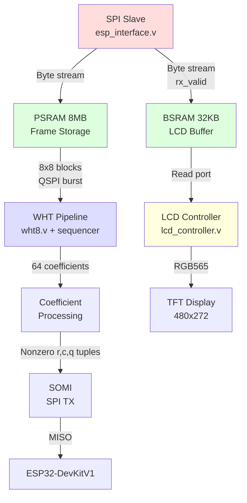

# Software Design Description 400
## FPGA Image Processing and Display Unit (Tang Nano 9K)

## References
- [SDD000](../../Documentation/SDDs/SDD000.md) - Development standards and architectural principles
- [FPGA Budget](./FPGA_Budget.md) - Resource utilization and timing analysis
- [Pin Map](./Pin_map.md) - Complete pin allocation reference

---

# Overview

## Hardware Platform
| Component | Specification                     |
|-----------|-----------------------------------|
| **FPGA**  | Gowin GW1NR-9C (Tang Nano 9K)     |
| **LUTs**  | 8640 total (4200 budgeted)        |
| **BRAM**  | 26 blocks @ 2KB each (52KB total) |
| **Clock** | 27 MHz system clock               |
| **Board** | Tang Nano 9K development board    |

## Development Toolchain
| Tool                   | Version              | Purpose                        |
|------------------------|----------------------|--------------------------------|
| **Yosys**              | Latest (open-source) | HDL synthesis                  |
| **nextpnr-himbaechel** | Latest               | Place and route (Gowin family) |
| **gowin_pack**         | Latest               | Bitstream generation           |
| **openFPGALoader**     | Latest               | FPGA programming               |

**Build System:** GNU Make (see `[Makefile](./Makefile)` in FPGA_Unit directory)

**Language:** Verilog (IEEE 1364-2005)

---

# Functional Scope

The FPGA subsystem performs three primary functions:

## 1. Image Data Reception
- **Interface:** SPI slave receiving from ESP32-DevKit
- **Protocol:** SPI Mode 0 (CPOL=0, CPHA=0)
- **Data rate:** ~2 Mbps (limited by SPI clock)
- **Buffering:** 32KB dual-port BRAM for frame storage

## 2. Image Compression & Transmission
- **Algorithm:** 2D Walsh-Hadamard Transform (WHT) with sequency masking
- **Implementation:** Custom combinational `wht8.v` butterfly, no IP cores
- **Output:** Thresholded and quantized WHT coefficients returned to ESP32 via SPI (SOMI)
- **Compression ratio:** ~120:1 (76.8 KB -> ~500 B typical)
- **Detail:** See [SDD401 — WHT Compression Pipeline](./SDD401.md)

## 3. Local Display Management
- **Display:** 480x272 RGB TFT LCD
- **Interface:** Parallel RGB565
- **Features:** Test pattern generation, button-cycled modes
- **Frame source:** BRAM buffer or test patterns

---

# Architecture

## Module Hierarchy

```
top.v
|---- esp_interface.v       (SPI slave receiver)
|---- bram_image_buffer.v   (32KB dual-port buffer — LCD display)
|---- lcd_controller.v      (RGB LCD timing generator)
|---- i2c_gpio_expander.v   (I2C slave — stepper + buttons)
|---- wht8.v                (8-point 1D WHT, combinational)
\---- [wht_pipeline.v]      (2D WHT compression — see SDD401)
```

## Data Flow Pipeline

```
ESP32-DevKit (SPI Master)
    v SPI (MOSI, SCLK, CS)
esp_interface.v
    v Parallel byte stream
    |---> BSRAM write (LCD buffer) ---> lcd_controller.v -> RGB LCD
    \---> PSRAM write (frame buffer) -> WHT pipeline -> coeff_out -> somi.v -> ESP32
```

See [SDD401](./SDD401.md) for full WHT pipeline design.

---

# Module Descriptions

## top.v - System Integration
**Purpose:** Top-level module connecting all subsystems

**Key Features:**
- Power-on reset generation (255-cycle delay)
- SPI-to-BRAM data path management
- Frame synchronization via CS edge detection
- Debug LED indicators for system state

**Interfaces:**
- **Input:** 27MHz system clock, SPI slave signals, button
- **Output:** RGB LCD signals, debug LEDs

**Critical Logic:**
- CS falling edge -> reset write address, begin frame reception
- CS rising edge -> mark frame complete, set `frame_ready` flag
- Continuous streaming: byte valid -> write to BRAM, increment address

## esp_interface.v - SPI Slave Controller
**Purpose:** Receive image data from ESP32-DevKit via SPI

**Implementation Details:**
- **Clock domain crossing:** 3-stage synchronizer for metastability prevention
- **Edge detection:** Rising/falling edge detection for SPI clock
- **Shift register:** 8-bit serial-to-parallel conversion
- **Output:** Byte-wide parallel data with valid strobe

**SPI Protocol:**
- Mode 0: Sample on rising edge, shift on falling edge
- MSB-first bit ordering
- Active-low chip select

**Current Status:** [DONE] Implemented and tested

## bram_image_buffer.v - Image Frame Buffer
**Purpose:** Dual-port RAM for concurrent write (SPI) and read (LCD/FFT)

**Implementation:**
- **Type:** Inferred single-clock dual-port RAM
- **Size:** 32KB (15-bit address space)
- **Synthesis:** Gowin BSRAM primitives (automatically inferred)

**Ports:**
- **Write:** SPI data stream (byte-wide)
- **Read:** LCD controller (byte-wide, grayscale)

**Note:** Dedicated to LCD display path only. Frame storage for WHT processing uses embedded PSRAM (see SDD401).

**Current Status:** [DONE] Functional

## lcd_controller.v - RGB Display Driver
**Purpose:** Generate RGB LCD timing and display content

**LCD Specification:**
- **Resolution:** 480x272 pixels
- **Interface:** RGB565 (5-bit R, 6-bit G, 5-bit B)
- **Timing:** HSYNC, VSYNC, DE (data enable), pixel clock

**Features:**
- **Test patterns:** 8 modes (solid colors, bars, gradients, checkerboard, BRAM data)
- **Button control:** Debounced button cycles through patterns
- **BRAM display mode:** Pattern 7 displays frame buffer content

**Timing Parameters:**
```
Horizontal: 480 active + 2 front + 41 sync + 2 back = 525 total
Vertical:   272 active + 2 front + 10 sync + 2 back = 286 total
Pixel clock: 13.5 MHz (27 MHz / 2)
```

**Current Status:** [DONE] Fully functional with test patterns

---

# WHT Compression Module

See **[SDD401 — WHT Compression Pipeline](./SDD401.md)** for full design.

## Summary

The compression pipeline uses a 2D Walsh-Hadamard Transform on 8x8 pixel blocks — custom RTL, no vendor IP cores. The `wht8.v` module is a combinational 3-stage butterfly (zero multipliers, additions/subtractions only) that maps directly from the branchless `FWHT` class in `sim/wht_core.py`.

**Compression Pipeline:**

```mermaid
flowchart TD
    IMG[Raw Image<br/>320x240 grayscale<br/>76.8 KB]
    TILE[8x8 Block Tiling<br/>1200 blocks]
    WHT2D[2D WHT<br/>Row then Column<br/>wht8.v combinational]
    MASK[Sequency Mask<br/>r + c ≤ threshold]
    THRESH[Soft Threshold<br/>Noise floor removal]
    QUANT[Quantize<br/>Arithmetic shift]
    SOMI[SOMI → ESP32<br/>~200-500 bytes]

     IMG --> TILE
     TILE --> WHT2D
     WHT2D --> MASK
     MASK --> THRESH
     THRESH --> QUANT
     QUANT --> SOMI

     IMG -.->|76.8 KB| SOMI
     SOMI -.->|~500 B typical<br/>~150:1 compression| RX[ESP32 → LoRa → Receiver]

     style IMG fill:#220000
     style WHT2D fill:#002200
     style SOMI fill:#222200
```


### Reconstruction (Receiver Side)
**Performed on ESP32-S3:**
1. Receive thresholded WHT coefficients via LoRa
2. Dequantize and place into 8x8 coefficient blocks
3. Inverse 2D WHT (same butterfly, divide by 64)
4. Gaussian smoothing on reconstructed diff
5. Add diff to reference frame

**Rationale:** Inverse WHT is cheap (same add/sub butterfly). All heavy lifting stays on the FPGA; the receiver just reverses the transform.

---

# Resource Utilization

## Current Implementation (base modules)
| Module             | LUTs       | BRAM   | Status |
|--------------------|------------|--------|--------|
| LCD RGB Controller | ~800       | 0      | [X]    |
| SPI Slave          | ~200       | 0      | [X]    |
| I2C GPIO Expander  | ~400       | 0      | [X]    |
| Control logic      | ~300       | 0      | [X]    |
| BRAM buffer        | (inferred) | 16     | [X]    |
| **Total**          | **~1700**  | **16** | [X]    |

## Projected Utilization (With WHT pipeline)
| Module                  | LUTs      | BRAM   | Status       |
|-------------------------|-----------|--------|--------------|
| WHT pipeline (SDD401)   | ~1580     | 0      | TODO  [ ]    |
| Existing modules         | ~1700     | 16     | [X]          |
| **Total**               | **~3280** | **16** | [X] **FITS** |

**Margin:** ~5360 LUTs remaining, 10 BRAM blocks unused. PSRAM is embedded (no LUT/BRAM cost).

---

# Timing Budget

## Image Processing Pipeline
```
ESP32-CAM -> ESP32-DevKit: Forward image
\--- SPI transfer: ~38 ms (2 Mbps, 76.8 KB frame)

FPGA: Receive + Process
|--- SPI reception: ~38 ms (concurrent with above)
|--- 2D WHT all 1200 blocks: ~19 ms (see SDD401 timing)
|--- Coefficient readback via SOMI: ~1 ms
\--- Total FPGA processing latency: ~20 ms

FPGA processing completes before next frame arrives — no backpressure.
```

---

# Interfaces

## SPI Slave (from ESP32-DevKit)
| Signal   | Direction | Pin | Description                  |
|----------|-----------|-----|------------------------------|
| esp_mosi | Input     | 49  | Master Out Slave In (data)   |
| esp_miso | Output    | 77  | Master In Slave Out (unused) |
| esp_sclk | Input     | 76  | SPI clock from master        |
| esp_cs_n | Input     | 48  | Chip select (active low)     |

**Protocol:** SPI Mode 0, byte-oriented streaming

## SOMI — SPI Return Path (SDD401)
| Signal     | Direction | Pin       | Description                           |
|------------|-----------|-----------|---------------------------------------|
| esp_miso   | Output    | 76        | Compressed coefficients (reuses existing SPI MISO pin) |
| tx_ready   | Output    | TBD       | High when coefficient data is ready for readback |

**Protocol:** ESP32 initiates SPI read (clocks in bytes on MISO) after `tx_ready` asserts. See SDD401 for full SOMI design.

## RGB LCD Interface
| Signal     | Direction | Pins                   | Description            |
|------------|-----------|------------------------|------------------------|
| lcd_clk    | Output    | 35                     | Pixel clock (13.5 MHz) |
| lcd_de     | Output    | 33                     | Data enable            |
| lcd_hsync  | Output    | 40                     | Horizontal sync        |
| lcd_vsync  | Output    | 34                     | Vertical sync          |
| lcd_r[4:0] | Output    | 71, 73, 75, 74, 72     | Red channel            |
| lcd_g[5:0] | Output    | 69, 70, 57, 68, 56, 55 | Green channel          |
| lcd_b[4:0] | Output    | 54, 53, 51, 42, 41     | Blue channel           |

**Format:** RGB565 (16-bit color depth)

---

# Build System

## Makefile Targets
```bash
make            # Synthesize, place & route, pack bitstream
make program    # Build and flash to FPGA
make flash      # Flash existing bitstream (skip rebuild)
make clean      # Remove build artifacts
```

## Build Flow
1. **Synthesis:** Yosys converts Verilog -> JSON netlist
2. **Place & Route:** nextpnr-himbaechel maps to FPGA fabric
3. **Pack:** gowin_pack generates .fs bitstream
4. **Program:** openFPGALoader flashes via USB-JTAG

**Build time:** ~30 seconds on typical development machine

---

# Development Status

## Completed [DONE]
- [x] SPI slave receiver with clock domain crossing
- [x] BRAM image buffer (dual-port)
- [x] RGB LCD controller with test patterns
- [x] Top-level integration and frame synchronization
- [x] Button debouncing and pattern cycling
- [x] I2C GPIO expander (stepper motor + joystick buttons)
- [x] Debug LED indicators
- [x] Build system and toolchain setup
- [x] wht8.v — 8-point combinational WHT butterfly (validated against sim)

## In Progress [WIP]
- [ ] PSRAM QSPI controller (psram_ctrl.v)
- [ ] 2D WHT sequencer + compression pipeline (SDD401)
- [ ] SOMI — SPI return path for compressed coefficients
- [ ] Dual-write during ingest (BSRAM + PSRAM)

## Future Work [TODO]
- [ ] Power management (watchdog, sleep modes)
- [ ] Dynamic compression ratio adjustment (runtime SEQ_THRESH / BLOCK_THRESH)

---

# Testing Strategy

## Unit Testing
- **SPI Interface:** Verified with ESP32 sending test patterns
- **LCD Controller:** All 8 test patterns validated on physical display
- **BRAM:** Read/write verification via pattern mode 7

## Integration Testing
- **End-to-end:** ESP32 -> SPI -> FPGA -> LCD (pending full image test)
- **WHT Pipeline:** Testbenches specified in SDD401 (wht_2d, coeff_out, psram_ctrl, somi)

## Debug Capabilities
- **LEDs:** 6 debug LEDs indicate system state (receiving, frame ready, CS, etc.)
- **Test patterns:** Button-cycled patterns verify LCD timing
- **Serial monitor:** UART debug output (to be added)

---

# Known Issues & Limitations

1. **MISO Unused:** SPI slave currently sends dummy data on MISO — SOMI module (SDD401) will own this pin during coefficient readback
2. **WHT Pipeline:** Integration in progress (SDD401)
3. **PSRAM:** Controller not yet implemented — required for frame storage and WHT block reads

---

# References

## Vendor Documentation
- [Gowin GW1NR-9 FPGA Family Datasheet](https://www.gowinsemi.com)
- [Tang Nano 9K Schematic & Pinout](http://tangnano.sipeed.com)
- [GW1NR-9C Embedded PSRAM Usage](https://www.gowinsemi.com) — QSPI interface to onboard 64 Mbit PSRAM

## Open-Source Toolchain
- [Yosys Open Synthesis Suite](https://github.com/YosysHQ/yosys)
- [nextpnr (Himbaechel for Gowin)](https://github.com/YosysHQ/nextpnr)
- [openFPGALoader](https://github.com/trabucayre/openFPGALoader)

## Related SDDs
- [SDD401 — WHT Compression Pipeline](./SDD401.md)
- [SDD003 — LoRa Link Budget](../../../Documentation/SDDs/SDD003.md)
- [SDD004 — LoRa Bench Test & Debug](../../../Documentation/SDDs/SDD004.md)

## Standards
- IEEE 1364-2005 (Verilog HDL)
- SPI Protocol (Motorola/IEEE)
- RGB LCD Timing Specifications (VESA standards)
