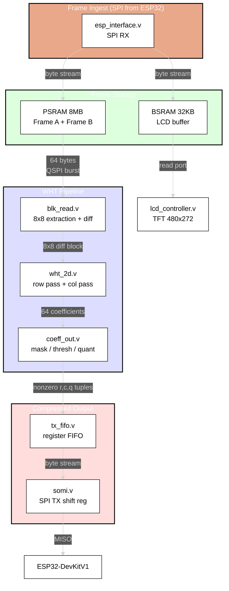
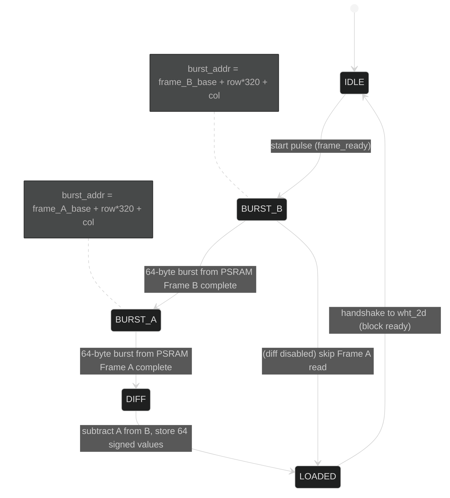
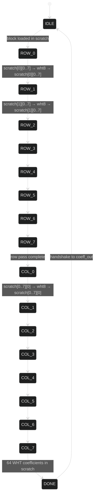
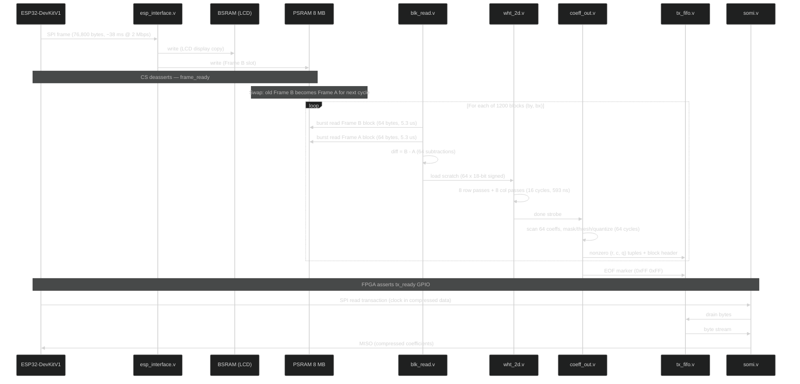

# Software Design Description 401
##  FPGA WHT Compression Pipeline

---

## Overview

This document describes the 2D Walsh-Hadamard Transform compression pipeline on the Tang Nano 9K FPGA.

**Implementation note:** The original design in this SDD called for a modular decomposition
(blk_read.v, wht_2d.v, coeff_out.v, somi.v, tx_fifo.v, psram_ctrl.v). The actual
implementation diverges significantly. All of those functions are folded into a single
monolithic FSM in blk_schd.v plus a tx_buf in top.v. The planned module names do not
exist as separate files. Sections of this document marked [AS DESIGNED] describe the
original intent; sections marked [AS BUILT] describe the actual RTL.

The datapath [AS BUILT] is:

  PSRAM (word reads via psram_read/psram_busy handshake)
  -> blk_schd LOAD state (64 diff words, cur_base vs prev_base)
  -> blk_schd WHT state (16 passes via wht2d.v / wht8.v, combinational)
  -> seq_msk.v (combinational, zeros r+c > 6)
  -> blk_schd WAIT state (coeff.v FSM, Top-K=5)
  -> blk_schd EMIT state (header + per-coeff tuples to top.v tx_buf)
  -> top.v tx_buf (512-byte BRAM) -> esp_interface.v tx_sr -> MISO -> ESP32

> **Hardware:** Tang Nano 9K (GW1NR-9C) | 27 MHz | 8640 LUTs | 26 BSRAM | 64 Mbit embedded PSRAM (QSPI)

---

## Table of Contents
- [Why PSRAM](#why-psram)
- [Architecture](#architecture)
- [PSRAM Interface](#psram-interface)
- [Module Descriptions](#module-descriptions)
- [Data Flow](#data-flow)
- [Frame Differencing](#frame-differencing)
- [Bit Width Analysis](#bit-width-analysis)
- [SOMI — SPI Return Path](#somi--spi-return-path)
- [Resource Estimate](#resource-estimate)
- [Configuration Parameters](#configuration-parameters)
- [Integration Checklist](#integration-checklist)
- [References](#references)

---

## Why PSRAM

The original design (SDD400) used 32KB of BSRAM for the frame buffer. This created three problems:

1. **Port contention.** The BSRAM has one write port (SPI ingest) and one read port (LCD controller). The WHT pipeline needs to read 8x8 blocks from arbitrary addresses — a second reader requires either true dual-port (burning the only remaining port) or time-multiplexing with the LCD during blanking intervals.

2. **No room for frame diffing.** The codec (`sim/codec.py:17-19`) operates on the *difference* between consecutive frames. Storing two 76.8 KB frames requires 153.6 KB — far beyond the 52 KB total BSRAM budget, and those blocks are also needed for scratch, FIFO, and future modules.

3. **Complexity.** Arbitrating BSRAM access between three consumers (SPI write, LCD read, WHT read) with non-overlapping timing constraints produces a fragile FSM that is hard to test and easy to break.

The GW1NR-9C has **64 Mbit (8 MB)** of embedded PSRAM accessible via a QSPI interface. At 27 MHz QSPI (108 Mbit/s effective), a 64-byte block read takes ~4.7 us. This is slower than BSRAM (~2.4 us) but still far faster than the LoRa link, and the simplification is worth it:

| Concern | BSRAM approach | PSRAM approach |
|---------|---------------|----------------|
| Frame A + Frame B storage | Impossible (153.6 KB) | Trivial (153.6 KB of 8 MB) |
| LCD read port | Shared, arbitrated | BSRAM stays dedicated to LCD |
| WHT block read | Fights LCD for port | Reads from PSRAM, no contention |
| BSRAM usage | Maxed out | Only LCD buffer (32 KB) |
| Complexity | High (3-way arbiter) | Low (PSRAM controller + block FSM) |

**BSRAM is not eliminated.** The LCD controller keeps its 32 KB BSRAM buffer — PSRAM latency is too high for pixel-clock-rate LCD reads. SPI ingest writes to *both* PSRAM (for WHT) and BSRAM (for LCD). This is one extra write per byte, trivially pipelined.

---

## Architecture

### Module Hierarchy [AS DESIGNED -- not implemented as described]

```
top.v
|---- esp_interface.v        (SPI slave -- RX path, active during frame ingest)
|---- somi.v                 (SPI slave -- TX shift register, active during readback)
|---- bram_image_buffer.v    (32KB -- LCD only, unchanged)
|---- psram_ctrl.v           (QSPI PSRAM controller)
|---- lcd_controller.v       (unchanged)
|---- i2c_gpio_expander.v    (unchanged)
|---- wht_pipeline.v         (top-level WHT orchestrator)
|    |---- blk_read.v        (8x8 block extraction from PSRAM)
|    |---- wht8.v            (8-point 1D WHT, combinational, existing)
|    |---- wht_2d.v          (2D sequencer: row pass, col pass)
|    \---- coeff_out.v       (sequency mask, threshold, quantize, serialize)
\---- tx_fifo.v              (coefficient output buffer, drains via somi.v)
```

### Module Hierarchy [AS BUILT]

```
top.v
|---- esp_interface.v   (SPI slave, RX + MISO TX path; tx_data from top.v tx_buf)
|---- bram_image_buffer.v (32KB LCD buffer -- unchanged)
|---- lcd_controller.v
|---- i2c_gpio_expander.v
|---- block_sched       (blk_schd.v -- monolithic LOAD/WHT/WAIT/EMIT/NEXT FSM)
|    |---- wht2d.v      (thin wht8 bus wrapper, combinational)
|    |    \---- wht8.v  (3-stage butterfly, W=16)
|    |---- seq_msk.v    (combinational, r+c > 6 -> zero; applied after WHT)
|    \---- coeff.v      (Top-K=5 extractor FSM; thresh=400, q_shift=3, seq_thresh=6)
```

Key structural differences from the design:
- No psram_ctrl.v: PSRAM reads use a direct psram_read / psram_busy handshake
  controlled entirely within blk_schd.v LOAD state. Reads are 16-bit words (2 pixels).
- No somi.v / tx_fifo.v: coefficient bytes flow from blk_schd tx_valid/tx_data into
  a 512-byte BRAM (tx_buf) in top.v. MISO is driven by esp_interface.v tx_sr, which
  is preloaded from tx_buf via tx_rd_data.
- No wht_pipeline.v / blk_read.v / wht_2d.v / coeff_out.v as separate files.
  blk_schd.v is the single orchestrator for all of those functions.
- Frame diff is FPGA-side (Option A from this SDD) and is implemented.
- W=16, not W=18. SEQ_THRESH=6 (not 2). BLOCK_THRESH=400. Q_SHIFT=3 (not 5).

### Pipeline Block Diagram



---

## PSRAM Interface

### Hardware

The GW1NR-9C embeds a 64 Mbit PSRAM die (W955D8MBYA or equivalent) connected to the FPGA fabric via dedicated QSPI pins. These are **not** general-purpose IO — they are hardwired internal connections on the GW1NR package.

| Signal | Direction | Notes |
|--------|-----------|-------|
| `psram_sclk` | Output | PSRAM clock (sys_clk or divided) |
| `psram_ce_n` | Output | Chip enable (active low) |
| `psram_sio[3:0]` | Bidir | Quad SPI data (QSPI mode) |

### psram_ctrl.v — QSPI Controller (new)

Provides a simple read/write interface to the rest of the design.

**Interface to pipeline:**

```verilog
// Command port
input  wire        cmd_valid,     // pulse to start transaction
input  wire        cmd_write,     // 1=write, 0=read
input  wire [22:0] cmd_addr,      // byte address (8 MB = 23 bits)
input  wire  [7:0] cmd_wdata,     // write data (1 byte per transaction)
output wire  [7:0] cmd_rdata,     // read data (valid on cmd_done)
output wire        cmd_done,      // transaction complete strobe

// Burst read port (for 8x8 block extraction)
input  wire        burst_start,   // pulse to start 64-byte burst read
input  wire [22:0] burst_addr,    // base address
output wire  [7:0] burst_data,    // output byte
output wire        burst_valid,   // data valid strobe (64 pulses)
output wire        burst_done     // all 64 bytes read
```

**PSRAM protocol (quad read, 0xEB):**

```
CE_n falls
Command:  0xEB (quad read)           — 2 clocks (4 bits/clock in QSPI)
Address:  24-bit addr                — 6 clocks
Wait:     6 dummy clocks             — latency
Data:     N bytes, 2 clocks/byte     — burst
CE_n rises
```

At 27 MHz QSPI, one byte reads in 2 clock cycles (74 ns). The 8-clock command+address+wait overhead amortizes well over a 64-byte burst:

| Operation | Clocks | Time @ 27 MHz |
|-----------|--------|---------------|
| Command + address + wait | 14 | 519 ns |
| 64 bytes data (2 clk/byte) | 128 | 4.74 us |
| **Total 8x8 block read** | **142** | **5.26 us** |

**Write path:** During SPI ingest, each byte is written to PSRAM as it arrives via `esp_interface.v`. Single-byte writes use command 0x38 (quad write). Since SPI ingest runs at ~2 Mbps (1 byte per ~4 us), and a PSRAM write completes in ~15 clocks (556 ns), there is no write bottleneck.

**Initialization:** The PSRAM requires a reset sequence on power-up (command 0xFF, wait 150 us). `psram_ctrl.v` runs this automatically before asserting a `psram_ready` signal.

### Memory Map

| Address Range | Size | Contents |
|---------------|------|----------|
| `0x000000 - 0x012BFF` | 76,800 B | Frame A (current reference) |
| `0x012C00 - 0x0257FF` | 76,800 B | Frame B (new frame from SPI) |
| `0x025800 - 0x7FFFFF` | ~7.85 MB | Reserved (future use) |

Frame layout: row-major, 320 bytes per row, 240 rows. Pixel at `(x, y)` = base + `y * 320 + x`.

---

## Module Descriptions

### wht8.v — 8-Point 1D WHT (existing)

Combinational three-stage butterfly. 8 signed inputs, 8 signed outputs, zero clock latency. Maps directly to the branchless `FWHT` class in `sim/wht_core.py`.

**Change required:** Widen parameter `W` from 16 to 18 for 2D bit-growth headroom (see [Bit Width Analysis](#bit-width-analysis)).

**No other changes.** The butterfly math is correct and validated.


### blk_read.v — 8x8 Block Extraction (new)

Reads an 8x8 pixel block from PSRAM and optionally computes the frame diff.

**Address generation:** For block at grid position `(by_cnt, bx_cnt)` in a 320-wide frame:

```
row_addr[i] = frame_base + (by_cnt * 8 + i) * 320 + bx_cnt * 8
            = frame_base + (by_cnt * 8 + i) << 8 + (by_cnt * 8 + i) << 6 + bx_cnt << 3
```

The multiply by 320 decomposes to `(N << 8) + (N << 6)` — two shifts and an add, no multiplier.

**Block cursor:** Two counters iterate all 1200 blocks:
- `by_cnt` — 5 bits, 0..29 (30 block rows)
- `bx_cnt` — 6 bits, 0..39 (40 block columns)

**Diffing (when enabled):** Reads the same 8x8 region from both Frame A and Frame B addresses, subtracts pixel-by-pixel (`B[i] - A[i]`, signed 9-bit result), and loads the diff values into the scratch registers. This maps directly to `codec.py:17-19` (`diff_frames`).

**Diffing (when disabled / TBD):** Reads only Frame B and loads unsigned pixel values directly. The pipeline operates on raw pixel data instead of diffs. Useful for keyframes or if the ESP32 sends pre-diffed data.

**State machine:**




### wht_2d.v — 2D WHT Sequencer (new)

Orchestrates the row-then-column 2D WHT over an 8x8 block stored in scratch registers.

**Scratch register file:** 64 entries x 18-bit signed. Implemented as flip-flops (1152 FFs). Not BSRAM — the mux pattern (row-major then column-major access) maps poorly to block RAM.

**Operation:** `wht8` is combinational — it produces outputs in the same clock cycle as inputs. The sequencer feeds one row (or column) of 8 values from scratch into `wht8`, then writes the 8 results back to scratch. This takes 1 clock cycle per row/column.

**Muxing:**

```
Row pass:  wht8_in[i] = scratch[row_idx][i]       i = 0..7
           scratch[row_idx][i] = wht8_out[i]       (write-back same cycle)

Col pass:  wht8_in[i] = scratch[i][col_idx]       i = 0..7
           scratch[i][col_idx] = wht8_out[i]       (write-back same cycle)
```

A single `pass` bit selects row-major vs column-major indexing. A 3-bit `idx` counter (0..7) selects which row or column.

**State machine:**



**Cycle count:** 8 (rows) + 8 (cols) = **16 clock cycles** per block. At 27 MHz = 593 ns.

**Validation:** The 2D output for any input block must match `sim/wht_core.py:wht_2D()` exactly. The sim's `FWHT` class uses the same branchless butterfly as `wht8.v`, so numerical agreement is guaranteed if the mux ordering is correct.


### coeff_out.v — Coefficient Processing (new)

Scans the 64 scratch values after 2D WHT and serializes nonzero coefficients.

**Pipeline stages (per coefficient, 1 clock each):**

1. **Sequency mask:** `skip = (r + c) > SEQ_THRESH`
   Single 4-bit adder + comparator. Masked positions treated as zero.
   Maps to `codec.py:23-38`.

   ```
   seq_thresh=0 : DC only          (1 coeff per block)
   seq_thresh=1 : + 1st order      (3 coeffs)
   seq_thresh=2 : + 2nd order      (6 coeffs)  <- default
   ```

2. **Soft threshold:** `abs(v) <= BLOCK_THRESH ? 0 : sign(v) * (abs(v) - BLOCK_THRESH)`
   Magnitude subtract + sign extraction. Attenuates small coefficients to zero.
   Maps to `codec.py:99-108`.

3. **Quantize:** `q = v_thresh >>> Q_SHIFT`
   Arithmetic right shift by 5 = divide by 32.
   Maps to `codec.py:110` (`round(attenuated[r][c] / q_step)`).

4. **Emit or skip:** If `q != 0`, push `(r, c, q)` into the TX FIFO. If `q == 0`, advance.

**Scan order:** Linear scan of all 64 positions (r=0..7, c=0..7), 1 clock per position. 64 clocks per block worst case. Most blocks are skipped entirely (ac_max < threshold, no coefficients emitted), matching `codec.py:93-97`.

**No top-K sorting.** The sim's `top_k=5` truncation is an optimization. For now, all nonzero post-threshold coefficients are emitted. If too many survive, raise `BLOCK_THRESH` or lower `SEQ_THRESH`. Sorting 64 values in hardware is expensive and unnecessary when the threshold does most of the work.

**Output wire format:**

Block header (emitted only for blocks with at least one nonzero coefficient):

| Byte | Content | Notes |
|------|---------|-------|
| 0 | `by_cnt[4:0], bx_cnt[5:3]` | Block row + upper 3 bits of block col |
| 1 | `bx_cnt[2:0], n_coeffs[4:0]` | Lower col bits + coefficient count |

Per-coefficient (repeated `n_coeffs` times):

| Byte | Content | Notes |
|------|---------|-------|
| 0 | `r[2:0], c[2:0], sign, 0` | Position + sign, packed 8 bits |
| 1 | `abs(q)[7:0]` | Quantized magnitude (unsigned) |

End-of-frame marker: `0xFF, 0xFF` (unambiguous — no valid block header has `n_coeffs=31` with `bx_cnt=7`).

**Byte budget per frame (typical):** For a mostly-static trail cam scene, the sim reports 200-500 bytes of compressed output. Even a high-motion frame produces a few KB at most. This is well within LoRa packet budgets.

---

## Data Flow

### Full frame processing sequence



### Timing budget

| Stage | Per-block time | Notes |
|-------|---------------|-------|
| PSRAM burst read (Frame B) | 5.26 us | 64 bytes via QSPI |
| PSRAM burst read (Frame A) | 5.26 us | Same (for diff) |
| Diff computation | ~2.4 us | 64 subtractions, pipelined with read |
| 2D WHT | 593 ns | 16 clock cycles |
| Coefficient scan | 2.37 us | 64 positions, 1 clk each |
| **Per-block total** | **~16 us** | Dominated by PSRAM reads |
| **Full frame (1200 blocks)** | **~19.2 ms** | |

Compare to SPI frame reception: ~38 ms. The WHT pipeline completes in half the time it takes to receive the next frame — **no backpressure, no stalls.**

Without frame diffing (single read), per-block drops to ~8.2 us and full frame to ~9.8 ms.

---

## Frame Differencing

> **Status: TBD** — decision pending on whether diffing happens on FPGA or ESP32.

### Option A: FPGA-side diff (described above)

PSRAM stores two frames. `blk_read.v` reads both and subtracts. This matches the sim exactly (`codec.py:diff_frames`).

**Pro:** ESP32 sends raw frames, no extra processing. Sim-accurate pipeline.
**Con:** Two PSRAM burst reads per block (doubles read time). PSRAM must store two frames (153.6 KB — trivial for 8 MB).

### Option B: ESP32 sends pre-diffed data

ESP32 computes `frame_B - frame_A` in software and sends the diff over SPI. FPGA stores only one buffer.

**Pro:** Half the PSRAM reads. Simpler `blk_read.v`.
**Con:** ESP32 must store two frames in its own RAM. Adds ~76 KB memory pressure + CPU time on the DevKitV1.

### Option C: Keyframe only (no diff)

Send raw pixel blocks through WHT without differencing. Higher byte cost but simplest pipeline.

**Pro:** Simplest. Good for initial bring-up and testing.
**Con:** Much higher coefficient output — static backgrounds produce many nonzero coefficients. May exceed LoRa budget.

**Recommendation:** Start with **Option C** for bring-up (prove the WHT + SOMI path works), then add **Option A** once the pipeline is validated.

---

## Bit Width Analysis

Pixel inputs are unsigned 8-bit (0-255). WHT operates on signed values.

| Stage | Width | Reasoning |
|-------|-------|-----------|
| Pixel input (raw) | u8 | Grayscale 0-255 |
| Sign-extended for WHT | s9 | Unsigned 8-bit -> signed 9-bit |
| Frame diff input | s9 | B - A range: -255 to +255 |
| After 1D WHT (3 butterfly stages) | s12 | Each stage can double magnitude: 9 + 3 |
| After 2D WHT (6 stages total) | s15 | 9 + 6 = 15 bits |
| **Scratch register width** | **s18** | 3 bits of headroom |
| **wht8 parameter W** | **18** | Changed from 16 |
| Post-soft-threshold | s18 | Same width, smaller magnitude |
| Post-quantize (>>>5) | s13 | Fits in u8 magnitude + sign for real images |

**Why W=18, not 16:** With diff inputs (signed 9-bit), 2D WHT worst case is 15 bits. W=16 signed holds +-16383 — only 1 bit of headroom. A single bug (DC offset, rounding, or unexpected input) causes silent overflow and corrupted coefficients. W=18 gives +-131071 — 3 full bits of margin. The cost is slightly wider adders in `wht8`; LUT impact is negligible.

---

## SOMI — SPI Return Path

### Why a separate module

The existing `esp_interface.v` is a clean RX-only SPI slave. Adding TX logic to it means interleaving two state machines (RX during ingest, TX during readback) with shared shift registers and mode switching. This is fragile and violates the project's one-file-one-purpose principle (SDD000).

Instead: a dedicated `somi.v` module that owns the MISO pin during coefficient readback.

### somi.v — SPI TX Shift Register (new)

**Interface:**

```verilog
module somi
    (input  wire       clk,
     input  wire       rst_n,

     // SPI pins (directly from top.v, active during readback phase)
     input  wire       sclk,        // ESP32 master clock
     input  wire       cs_n,        // chip select (directly from ESP32)
     output reg        miso,        // shift register output

     // FIFO drain
     output wire       fifo_pop,    // pop strobe to tx_fifo
     input  wire [7:0] fifo_data,   // byte from tx_fifo
     input  wire       fifo_empty); // nothing to send (shift out 0x00)
```

**Operation:**
- Synchronizes `sclk` and `cs_n` with the same 3-stage pattern as `esp_interface.v`
- On each `sclk` falling edge (SPI Mode 0: master samples on rise, slave shifts on fall): shift out one bit MSB-first
- On byte boundary: pop next byte from FIFO, or load `0x00` if FIFO empty
- When `cs_n` deasserts: reset bit counter, release MISO

**Phase separation:** The ESP32 knows whether it is sending a frame (SPI write) or reading coefficients (SPI read). During writes, `somi.v` sees `fifo_empty=1` and outputs `0x00` — harmless. During reads, the ESP32 sends dummy `0x00` bytes on MOSI, which `esp_interface.v` receives and ignores (no `frame_ready` set because the write address never reaches frame size).

**Alternative considered:** Directly muxing MISO between `esp_interface.v` and `somi.v` based on a direction bit. Rejected — simpler to let both modules drive their logic independently and use a direction signal in `top.v` to select which feeds the physical pin:

```verilog
wire spi_writing = receiving;  // existing flag from SPI RX logic
assign esp_miso = spi_writing ? esp_miso_rx : somi_miso;
```

### tx_fifo.v — Output Buffer (new)

Register-based FIFO, 256 bytes. Written by `coeff_out.v`, drained by `somi.v`.

256 bytes is sufficient — even a high-activity frame produces < 2 KB of coefficients, and the FIFO drains concurrently during processing. If the FIFO fills (pathological case), `coeff_out.v` stalls until space is available.

**Signals:**

```verilog
// Write side (from coeff_out)
input  wire       wr_en,
input  wire [7:0] wr_data,
output wire       full,

// Read side (from somi)
input  wire       rd_en,
output wire [7:0] rd_data,
output wire       empty,
output wire [7:0] count      // bytes available (for status/debug)
```

### Handshake with ESP32

The FPGA asserts a `tx_ready` GPIO (directly from `top.v`) when the WHT pipeline has finished processing and the FIFO contains valid data. The ESP32 polls or interrupts on this pin, then initiates an SPI read transaction to drain the coefficients.

| Signal | Pin | Direction | Notes |
|--------|-----|-----------|-------|
| `tx_ready` | TBD | FPGA -> ESP32 | High when coefficients ready |

The ESP32 reads until it receives the EOF marker (`0xFF 0xFF`), then stops clocking.

---

## Resource Estimate

| Module | LUTs (est.) | BSRAM | FFs | Notes |
|--------|-------------|-------|-----|-------|
| wht8 (W=18) | ~280 | 0 | 0 | Combinational, wider adders |
| wht_2d | ~300 | 0 | ~1200 | Scratch regs (64x18) + FSM |
| blk_read | ~200 | 0 | ~60 | Address gen + counters + diff |
| coeff_out | ~200 | 0 | ~100 | Mask/thresh/quant + scan |
| psram_ctrl | ~400 | 0 | ~80 | QSPI state machine |
| somi | ~100 | 0 | ~30 | TX shift register |
| tx_fifo (256B) | ~100 | 0 | ~2100 | Register FIFO |
| **Pipeline total** | **~1580** | **0** | **~3570** | |
| Existing (SPI RX + BSRAM + LCD + I2C) | ~1300 | 16 | — | Unchanged |
| **Grand total** | **~2880** | **16** | — | **33% of 8640 LUTs** |

Plenty of room. No additional BSRAM consumed. PSRAM is free (embedded in package).

---

## Configuration Parameters

Defined as `localparam` in a shared `wht_config.vh` include file:

| Parameter | Default | Sim equivalent | Notes |
|-----------|---------|----------------|-------|
| `W` | 18 | `BIT_WIDTH=16` | Widened for 2D safety margin |
| `SEQ_THRESH` | 2 | `seq_thresh=2` | Sequency mask cutoff (r+c) |
| `BLOCK_THRESH` | 400 | `block_threshold=400` | AC magnitude noise floor |
| `Q_SHIFT` | 5 | `q_step=32` | Right shift = divide by 32 |
| `FRAME_W` | 320 | hardcoded | Pixels per row |
| `FRAME_H` | 240 | hardcoded | Rows per frame |
| `FRAME_A_BASE` | `23'h000000` | — | PSRAM base address, Frame A |
| `FRAME_B_BASE` | `23'h012C00` | — | PSRAM base address, Frame B |
| `DIFF_ENABLE` | 0 | — | 0=raw pixels, 1=frame diff (TBD) |

---

## Known Bugs [AS BUILT]

See UTR501 for full test report.

1. **Bug 1 -- MISO inter-byte shift (esp_interface.v):** CONFIRMED, 22 sim failures.
   After tx_sr is reloaded on byte_done_d, the next falling SCLK edge (between-bytes)
   shifts tx_sr left by 1 before the master has sampled the new bit 7. Result: every
   byte[N>=1] received by ESP32 = correct_byte << 1. The between-bytes falling edge
   must be suppressed; shift should only occur when bit_count != 0 (i.e. after the
   master has sampled bit 7 of the freshly-loaded byte on the following rising edge).

2. **Bug 2 -- blk_schd_tb PSRAM mock deadlock:** CONFIRMED, sim hangs.
   The testbench mock uses an edge-detection scheme to clear psram_busy. blk_schd
   can issue a second read in the same cycle that psram_busy transitions 1->0 (reading
   stale 0), clearing psram_pending before the mock delivers rdata. psram_busy then
   stays asserted permanently. Fix: replace the mock with a cycle countdown register.

3. **Bug 3 -- top.v tx_buf registered-read lag:** IDENTIFIED, not yet sim-confirmed.
   tx_rd_data is a synchronous BRAM read -- 1-cycle latency from tx_rd_ptr. When
   byte_done_d fires and tx_sr is reloaded, tx_rd_data may still reflect the previous
   tx_rd_ptr value. The two inter-related timing requirements (MISO shift fix and
   tx_buf read timing) must be resolved together.

## Integration Checklist [AS BUILT STATUS]

### FPGA RTL
- [x] Dual write (BSRAM + PSRAM) during SPI ingest
- [x] blk_schd.v -- full pipeline FSM (replaces blk_read/wht_2d/coeff_out/somi/tx_fifo)
- [x] wht2d.v -- wht8 wrapper
- [x] seq_msk.v -- sequency mask
- [x] coeff.v -- Top-K extractor
- [x] top.v tx_buf -- 512-byte BRAM coefficient buffer
- [x] MISO TX path in esp_interface.v (has Bug 1, needs fix)
- [ ] Fix Bug 1: MISO inter-byte shift
- [ ] Fix Bug 3: tx_buf registered-read lag
- [ ] psram_ctrl.v -- QSPI burst read (not implemented; current PSRAM reads are word-at-a-time)

### Testbench
- [x] wht8_tb.v -- PASS (6/6)
- [x] coeff_tb.v -- PASS (6/6)
- [x] esp_interface_tx_tb.v -- FAIL (22 errors, Bug 1 confirmed)
- [x] blk_schd_tb.v -- TIMEOUT (Bug 2 confirmed, testbench fix needed)
- [ ] Fix blk_schd_tb PSRAM mock (cycle countdown)
- [ ] Re-run blk_schd_tb after mock fix to validate pipeline

### ESP32 DevKitV1
- [x] SPI read transaction in fpga_spi.c (clocks in compressed data)
- [ ] Coefficient parse: block headers + per-coeff tuples (partially done)
- [ ] Heap fix: safe_free in cam_spi rx_reset (Bug 4)

### Validation
- [ ] End-to-end: known test image -> FPGA -> coefficients match sim
- [ ] Round-trip: FPGA output -> sim/codec.py:decode_frame() -> PSNR check

---

## References

- [SDD400 — FPGA Subsystem Overview](./SDD400.md)
- [SDD003 — LoRa Link Budget](../../../Documentation/SDDs/SDD003.md)
- [SDD004 — LoRa Bench Test & Debug](../../../Documentation/SDDs/SDD004.md)
- `sim/wht_core.py` — Reference WHT implementation (branchless class maps to `wht8.v`)
- `sim/codec.py` — Encode/decode pipeline (sequency mask, threshold, quantize, top-K)
- `fpga/src/rtl/wht8.v` — Existing 1D combinational butterfly
- [GW1NR-9C PSRAM Usage Guide](https://www.gowinsemi.com) — Gowin embedded PSRAM documentation

### Source files created or modified by this SDD

| File | Change |
|------|--------|
| `fpga/src/rtl/wht8.v` | Parameter `W` default 16 -> 18 |
| `fpga/src/rtl/psram_ctrl.v` | New — QSPI PSRAM controller |
| `fpga/src/rtl/blk_read.v` | New — 8x8 block extraction from PSRAM |
| `fpga/src/rtl/wht_2d.v` | New — 2D WHT sequencer FSM |
| `fpga/src/rtl/coeff_out.v` | New — coefficient processing + serialization |
| `fpga/src/rtl/tx_fifo.v` | New — 256-byte output FIFO |
| `fpga/src/rtl/somi.v` | New — SPI TX shift register |
| `fpga/src/rtl/wht_config.vh` | New — shared parameter definitions |
| `fpga/src/rtl/top.v` | Instantiate pipeline, dual-write, MISO mux, tx_ready GPIO |
| `fpga/src/rtl/bram_image_buffer.v` | Unchanged (LCD-only) |
| `esp/esp32_devkitv1/main/src/interprocessor/fpga_spi.c` | Add SPI read for compressed data |
