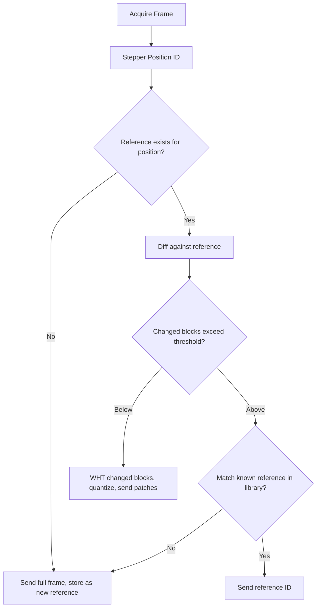

# Software Design Description 500
## Explicit Image Processing Algorithm High level Description

```mermaid
flowchart TD
    A[Acquire Frame] --> B[Stepper Position ID]
    B --> C{Reference exists for position?}
    C --> |No| D[Send full frame, store as new reference]
    C --> |Yes| E[Diff against reference]
    E --> F{Changed blocks exceed threshold?}
    F --> |Above| G{Match known reference in library?}
    F --> |Below| H[WHT changed blocks, quantize, send patches]
    G --> |Yes| I[Send reference ID]
    G --> |No| D
```

