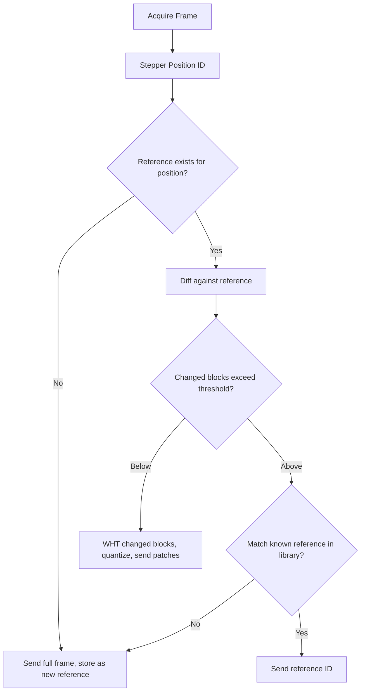

# Software Design Description 500
## Image Processing Algorithm — High Level Description

## Related Documents
- [SDD501](./SDD501.md) — Walsh-Hadamard Transform: mathematical derivation, branchless implementation, FPGA architecture
- [SDD502](./SDD502.md) — Phone-side Gaussian reconstruction and aggressive compression mode

---

## Overview

The image processing pipeline is designed around one constraint: the LoRa link runs at 683 bytes/second at SF7. A raw 320×240 grayscale frame is 76,800 bytes. Transmitting raw frames is not an option.

The strategy is to never transmit what the receiver can already reconstruct. This drives every decision in the pipeline.

---

## Core Strategy

### Inter-Frame Differencing
The camera is stationary. Between any two frames of a static scene, the only meaningful difference is sensor noise. When an animal enters the frame, a sparse set of 8×8 blocks will change significantly. Everything else stays the same.

Rather than transmitting frames, the system transmits the *difference* between the current frame and a stored reference. The receiver maintains the same reference and applies the diff to reconstruct the current frame. For a static scene with a small animal, typically fewer than 10% of blocks change — the rest cost nothing to transmit.

### Reference Frame Library
The camera uses a stepper motor for pan/tilt, meaning the same scene can be observed from multiple known positions. Each stepper position gets its own reference frame. On first visit to a position, a full frame is transmitted and stored as the reference. On subsequent visits, only diffs are sent.

If scene content changes significantly (lighting shift, seasonal change, camera disturbed), the diff against the stored reference will exceed a threshold. The system detects this and transmits a new full frame to update the reference.

### WHT Compression of Diff Blocks
For blocks that do change, the raw pixel diff is not transmitted. Instead, each changed 8×8 block is transformed using the Walsh-Hadamard Transform (WHT). The WHT concentrates the energy of structured motion into a small number of coefficients. The remaining coefficients fall below the noise floor and are discarded.

The WHT was chosen over the DCT (used in JPEG) for one reason: it requires no multiplications. Every butterfly operation is a single add and subtract. This maps directly to FPGA hardware with minimal area and power, and is the foundational insight behind the compression pipeline (see SDD501).

### Noise Floor Thresholding
Sensor noise appears as small, uniformly distributed values in the WHT domain. Real motion produces large, structured coefficients well above the noise floor. An adaptive threshold — derived empirically from static frame captures — separates signal from noise. Only coefficients above this threshold are quantized and transmitted.

This is a stochastic problem: sensor noise is a Gaussian random process, and its WHT representation is also Gaussian (the Hadamard matrix is orthogonal, so white noise stays white). The threshold is set at 3σ of the noise distribution, characterised per deployment from a static calibration capture.

### DC Term and Exposure Drift
A global brightness shift (exposure drift, cloud cover, etc.) appears entirely in the DC coefficient of every block — the WHT equivalent of the mean pixel value. Since the DC term carries no motion information, it is excluded from both the change detection threshold and the transmitted coefficient set. This makes the pipeline robust to lighting variation without any explicit exposure compensation.

---

## Pipeline Flowchart

---

## Design Decisions

### Why 8×8 Blocks
8×8 is the smallest power-of-two block size that captures meaningful spatial structure. Smaller blocks increase per-block overhead. Larger blocks reduce spatial resolution of the diff and increase the number of coefficients needed to represent a sharp edge. 8×8 is also the standard block size in JPEG/H.264 for the same reasons, and the WHT butterfly for N=8 requires exactly 12 clock cycles in the branchless implementation.

### Why Not JPEG
JPEG uses the Discrete Cosine Transform, which requires multiplications. On the Tang Nano 9K, a hardware multiplier costs significantly more area and power than an adder. The WHT trades a small amount of compression efficiency for a transform that is purely additive — directly implementable as a sequential butterfly with no multipliers.

### Why Not H.264
H.264 is designed for compute-rich environments. Motion vector search, B-frames, entropy coding, and cabac are not implementable on a low-power FPGA within the resource budget. The WHT pipeline is designed from the constraints up: minimal memory, no multipliers, pipelineable, and implementable in under 4,000 LUTs on the Tang Nano 9K.

### Compression Modes
Two transmission modes are supported depending on the nature of the motion event:

**WHT Patch Mode** (default): Changed blocks are WHT-transformed, top-N AC coefficients are quantized and transmitted with block addresses. Receiver applies inverse WHT and overlays on reference. Validated to achieve >40x compression on typical wildlife motion events.

**DC + Gaussian Mode** (aggressive): Only the DC coefficient of each changed block is transmitted, with a bounding box and active-block bitmap. The phone reconstructs smooth structure via Gaussian interpolation over the sparse DC grid. Trades edge fidelity for bandwidth — useful for large animals or high-rate scenarios. Described in detail in SDD502.

---

## Implementation Status

| Component                        | Status      |
|----------------------------------|-------------|
| Frame differencing               | Implemented (Python simulation) |
| WHT branchless state machine     | Implemented and validated       |
| 2D WHT on real camera frames     | Implemented and validated       |
| Noise floor characterization     | Pending — static dataset needed |
| Adaptive thresholding            | Pending noise floor             |
| Quantization                     | Pending                         |
| FPGA WHT module                  | Pending                         |
| Reference frame library          | Pending                         |
| Stepper position ID integration  | Pending                         |
| Phone-side reconstruction        | Pending (see SDD502)            |
## Explicit Image Processing Algorithm High level Description

