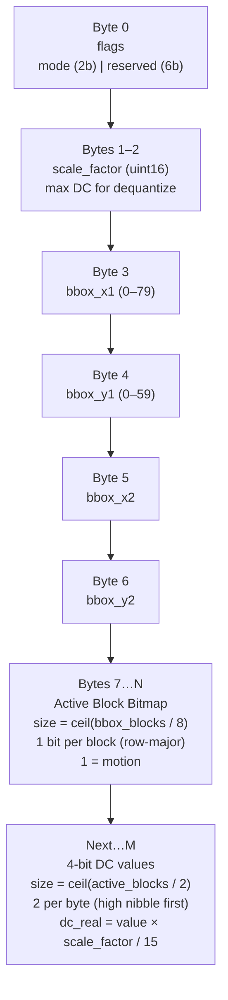
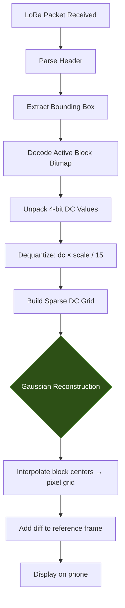

# Software Design Description 502 | Phone-Side Gaussian Reconstruction

## Brief

The WHT compression pipeline (SDD501) crushes structured motion data — 325x compression at 45 dB for a deer, 3,234x for a squirrel. But the real bottleneck isn't the transform. It's the LoRa link at 683 bytes/sec (SF7). The question becomes: what's the absolute minimum you can send and still get a recognizable image on the phone?

The answer is the **4-bit DC + Bounding Box + Gaussian** mode. Instead of sending full WHT coefficients per block, you send only the DC component (average brightness delta) quantized to 4 bits, with bounding-box addressing to eliminate per-block IDs. The phone reconstructs the smooth structure using Gaussian interpolation over the sparse DC grid. The result: a deer in **~115 bytes at 6 FPS** instead of 631 bytes at 1.1 FPS.

This SDD covers the receive-side reconstruction pipeline — everything that happens after the LoRa packet lands on the phone.

## The Compression Stack

Each layer trades fidelity for bandwidth. They stack:

```
Layer 0: Raw frame                        307,200 bytes    —
Layer 1: Frame differencing               only changed pixels sent
Layer 2: Block detection (8×8, threshold)  157 blocks for a deer (~3% of frame)
Layer 3: WHT top-N coefficient selection   325x compression at 45 dB (N=1)
Layer 4: Packed encoding (bbox + bitmap)   487x → 631 bytes at 1.1 FPS
Layer 5: 4-bit DC quantization + Gaussian  2,695x → ~115 bytes at 6.0 FPS  ← THIS SDD
```

## Packet Format — Aggressive Mode



### Byte Budget (Small Deer — 157 blocks in ~15×9 bbox)

| Component    | Bytes   | Notes               |
|--------------|---------|---------------------|
| Frame header | 3       | mode + scale factor |
| Bounding box | 4       | x1, y1, x2, y2      |
| Bitmap       | 17      | ceil(135 / 8)       |
| DC values    | 79      | ceil(157 / 2)       |
| **Total**    | **103** | **6.6 FPS at SF7**  |

### Comparison to Other Modes

| Mode                     | Bytes    | Compression | PSNR         | SF7 FPS  |
|--------------------------|----------|-------------|--------------|----------|
| WHT top-1 (old encoding) | 944      | 325x        | 45.0 dB      | 0.7      |
| WHT top-1 (packed)       | 631      | 487x        | 45.0 dB      | 1.1      |
| WHT top-2 (packed)       | 945      | 325x        | 49.4 dB      | 0.7      |
| **4-bit DC + Gaussian**  | **~115** | **2,695x**  | **~44.9 dB** | **~6.0** |
| 8-bit DC + Gaussian      | ~192     | 1,600x      | ~45.0 dB     | 3.6      |

## Reconstruction Algorithm

The phone receives a sparse grid of 4-bit DC values positioned within a bounding box. It needs to turn this into a full-resolution diff image to overlay on the reference frame.

### Step 1: Unpack & Dequantize

```
for each active block in bitmap:
    dc_4bit = next nibble from packed data
    dc_real = dc_4bit * scale_factor / 15
    diff_grid[block_y][block_x] = dc_real
```

The DC coefficient of an 8×8 WHT block is the sum of all 64 pixel values. To reconstruct block-level brightness, divide by 64 (the block area). This gives the average pixel delta for that block.

### Step 2: Gaussian Interpolation (Block → Pixel)

Each DC value represents a single brightness measurement for an 8×8 region. The raw reconstruction would be flat blocks — visible 8×8 grid artifacts. Gaussian interpolation smooths between adjacent block DC values to produce a continuous diff image.

$$
\hat{d}(x,y) = \frac{\sum_{(i,j) \in \mathcal{N}} w_{ij} \cdot DC_{ij}}{\sum_{(i,j) \in \mathcal{N}} w_{ij}}
$$

where the weights are:

$$
w_{ij} = \exp\!\left(-\frac{(x - c_i)^2 + (y - c_j)^2}{2\sigma^2}\right)
$$

and $(c_i, c_j)$ is the center pixel of block $(i, j)$, and $\mathcal{N}$ is the set of active neighboring blocks within the kernel radius.

**Sigma selection:** σ = 1.0–1.5 block widths (8–12 pixels). Sigma is insensitive in this range — the sweep from σ=0.5 to σ=3.0 produced less than 0.04 dB variation in PSNR. The smoothing is robust because the underlying diff signal (animal silhouettes) is inherently smooth.

### Step 3: Apply to Reference

```
output[y][x] = reference[y][x] + diff_reconstructed[y][x]
clamp to [0, 255]
```

## Flowchart



## Implementation Notes

### Why 4-bit and Not Lower?

At 4 bits (16 levels), the quantization step for a typical diff (max ~80) is about 5 intensity levels. On smooth animal silhouettes this is nearly invisible after Gaussian smoothing. At 3 bits (8 levels) the steps become 10 intensity levels — visible banding on large targets. 4 bits is the sweet spot.

### Why Bounding Box + Bitmap?

Per-block addressing (2 bytes per block × 157 blocks = 314 bytes) dominates the packet at low coefficient counts. The bounding box + bitmap trick replaces 314 bytes of addressing with 4 + 17 = 21 bytes — an **93% reduction** in overhead. This is what makes the 4-bit mode viable.

### Phone Compute Budget

The Gaussian interpolation is cheap:
- For a 157-block deer, you're smoothing a ~15×9 sparse grid onto a 120×72 pixel region
- That's roughly 8,640 weighted averages with a 3×3 kernel
- On any modern phone: <1 ms

The phone has orders of magnitude more compute than it needs. Let it do the work.

### Platform

<!-- TODO: Decide Kotlin (Android) vs Swift (iOS) vs React Native -->
<!-- The receive pipeline is platform-independent math. The only dependency is LoRa BLE receive. -->

Target platform: TBD. The algorithm is pure arithmetic — no platform-specific dependencies beyond the BLE/LoRa receiver interface.

## Higher FPS Ideas — Open Questions

The 4-bit DC mode gets us to ~6 FPS for a deer. To push higher:

1. **Delta-encode DC values within the bounding box.** Neighboring blocks have similar DC values. Sending deltas instead of absolutes could save 10–20 bytes, pushing closer to 7+ FPS.

2. **Adaptive quantization.** 4-bit for large smooth regions, 8-bit for edge blocks. Send a 1-bit mask for which mode each block uses.

3. **Temporal prediction.** If the animal is moving slowly, the next frame's DC values are close to the previous frame's. Send only the change-of-change. This could halve the payload for sustained motion.

4. **Variable bounding boxes.** Multiple small bounding boxes for scattered motion (3 squirrels) could be more efficient than one large sparse bbox.

5. **Run-length encoding on the bitmap.** For highly contiguous motion blobs, RLE on the active-block bitmap could save a few more bytes.

6. **LoRa SF6.** Dropping from SF7 to SF6 roughly doubles throughput to ~1,200 bytes/sec at the cost of range. At 2-mile deployment range this may still work.

## Simulation Results (from SDD501 validation)

Validated on real camera frames (640×480 grayscale) with synthetic structured motion overlays:

| Scenario | Changed Blocks | 4-bit DC Bytes | Compression | SF7 FPS | Est. PSNR |
|----------|---------------|----------------|-------------|---------|-----------|
| Squirrel (~1%) | 23 | ~20 | ~15,360x | ~34 | >45 dB |
| 3 Squirrels (~1.5%) | 70 | ~56 | ~5,486x | ~12 | >44 dB |
| Small deer (~3%) | 157 | ~103 | ~2,983x | ~6.6 | ~44.9 dB |
| Big deer (~17%) | 864 | ~475 | ~647x | ~1.4 | ~42 dB |
| Deer moved 8px | 161 | ~106 | ~2,898x | ~6.4 | ~43 dB |

## Related Documents

- **SDD500** — Image Processing Algorithm High-Level Description (frame acquisition, reference management, diff pipeline)
- **SDD501** — Walsh-Hadamard Transforms (the WHT math, COND_NEGATE identity, butterfly implementation, FPGA architecture)
- **SDD403** — Trail Camera IV System Architecture (ESP32-CAM → ESP32-S3 → FPGA → LoRa → Phone)
